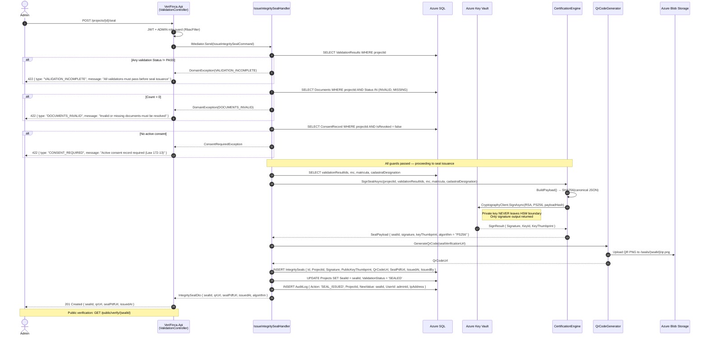
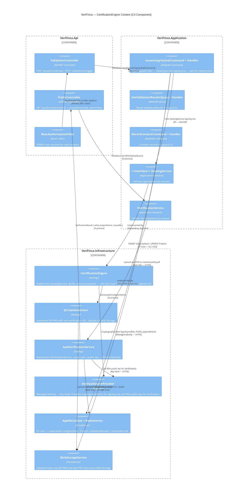

# ADR-005: Integrity Seal Signing with RSA-2048 via Azure Key Vault (Law 126-02)

**Date:** 2026-06-29
**Status:** Proposed
**Supersedes:** ADR-009 (basic informative certification — superseded by legally-signing seal)
**Referenced in:** `TRD_VeriFinca.md §5` · `ARCHITECTURE.md §5` · `AGENTS.md §16` · `legal-framework.md §Law 126-02`

---

## Context

VeriFinca must issue a **Digital Integrity Seal** for real estate projects that pass all validations. Per **Law 126-02 (Digital Commerce) Article 32** of the Dominican Republic, a digital signature holds the same legal validity as a handwritten signature when it meets:

- **Reliable authentication** of the signatory (the platform)
- **Integrity** of the signed data (tamper detection)
- **Non-repudiation** (the signatory cannot deny having signed)
- **Exclusive signatory control** of the signing key

The seal serves as the final output of the verification pipeline (RF-10 / OE-7). It is presented as a QR code that the public scans (RF-11) to verify a property's integrity status.

**Key constraints:**

| Constraint | Source |
|---|---|
| Private key must never leave hardware-backed security boundary | Law 126-02 Art. 32; AGENTS.md §16 Invariant 5 |
| Signature must be publicly verifiable without calling the platform | RF-11 public verification |
| Signing algorithm must be RSA-2048 or stronger | AGENTS.md §1 (Law 126-02 Gate) |
| Seal must only be issuable when guard chain passes | AGENTS.md §16 Invariant 5 |
| Every signing operation must be auditable | Law 126-02 electronic evidence requirement |
| Zero secrets in application memory or disk | ADR-003 (Key Vault as sole secret store) |

**Current state:** ADR-009 defined a basic informative certification (CSPRNG code, frontend QR, no digital signature) because no INDOTEL-accredited Certification Authority (CA) was integrated. However, the platform now has Azure Key Vault with RSA-2048 keys (established in ADR-003), and the legal framework mandates that the seal carry a legally-signing digital signature — meaning ADR-009's approach is insufficient for production.

---

## Decision

**Sign the Integrity Seal using RSA-2048 via Azure Key Vault's CryptographyClient**, wrapped in a `CertificationEngine` abstraction in `Infrastructure/Sealing/`. The private key **never leaves the Key Vault HSM boundary** — the `CryptographyClient.SignAsync()` operation returns only the signature output.

### Architecture

```
┌─────────────────────────────────────────────────────────┐
│                    VeriFinca.Api                         │
│  POST /projects/{id}/seal → ValidationController         │
└───────────────────┬─────────────────────────────────────┘
                    │ IMediator.Send(IssueIntegritySealCommand)
                    ▼
┌─────────────────────────────────────────────────────────┐
│              VeriFinca.Application                       │
│  IssueIntegritySealCommandHandler                        │
│  ┌─────────────────────────────────────────────────┐    │
│  │ Guard Chain (all MUST pass before signing):      │    │
│  │ 1. All ValidationResults.Status == PASS          │    │
│  │ 2. No Document.Status IN (INVALID, MISSING)      │    │
│  │ 3. Active ConsentRecord (IsRevoked == false)     │    │
│  └─────────────────────────────────────────────────┘    │
│                    │                                     │
│                    │ ISealingService.SignAsync(payload)  │
└───────────────────┬─────────────────────────────────────┘
                    ▼
┌─────────────────────────────────────────────────────────┐
│           VeriFinca.Infrastructure                       │
│  ┌─────────────────────────────────────────────────┐    │
│  │ CertificationEngine                               │    │
│  │  ├── BuildPayload() → SHA256(projectId +         │    │
│  │  │   validationHash + issuedAt + previousSealId) │    │
│  │  └── SignWithKeyVaultAsync(payloadHash)          │    │
│  │       → KeyVault CryptographyClient.SignAsync()  │    │
│  │       → Returns { Signature, KeyId, Thumbprint } │    │
│  └─────────────────────────────────────────────────┘    │
│  ┌─────────────────────────────────────────────────┐    │
│  │ QrCodeGenerator                                   │    │
│  │  └── GenerateQrCode(sealVerificationUrl)          │    │
│  │       → QR PNG saved to blob as seal artifact    │    │
│  └─────────────────────────────────────────────────┘    │
└─────────────────────────────────────────────────────────┘
```

### Signature Payload

The signed payload covers the following canonical representation:

```
SHA256(CANONICAL(
  projectId: uuid,
  validationHash: SHA256(sorted(validationResultIds)),
  issuedAt: ISO8601,
  previousSealId: uuid | null,
  projectDataHash: SHA256(rnc + matricula + cadastralDesignation)
))
```

This ensures:
- **Integrity:** Any change to validation results, project data, or issuance timestamp invalidates the signature
- **Non-repudiation:** The RSA signature can only be produced with the private key held in Key Vault
- **Chainability:** `previousSealId` links successive seals for the same project (if re-sealed after re-validation)

### Public Verification

The public verification endpoint `GET /public/verify/{sealId}` (RF-11) performs:

1. Load `IntegritySeal` record from DB
2. Recompute `payloadHash` from current project and validation state
3. Fetch the RSA public key from `/.well-known/signing-key.pem` (published from Key Vault)
4. Verify the stored `Signature` against the recomputed hash using `RSA.VerifyHash()` with `HashAlgorithmName.SHA256` and `RSASignaturePadding.Pss`
5. Return `{ valid: bool, projectId, issuedAt, projectName, overallStatus }`

### Guard Chain (Enforced in Handler)

The `IssueIntegritySealCommandHandler` executes a **three-gate guard chain** before calling the signing service:

| Gate | Check | Failure Response |
|---|---|---|
| **G1 — Validations** | `SELECT ValidationResults WHERE projectId` — all `Status = PASS` | `422 VALIDATION_INCOMPLETE` |
| **G2 — Documents** | `SELECT Documents WHERE projectId AND Status IN (INVALID, MISSING)` — count = 0 | `422 DOCUMENTS_INVALID` |
| **G3 — Consent** | `SELECT ConsentRecord WHERE projectId AND IsRevoked = false` — exists | `422 CONSENT_REQUIRED` |

### Key Rotation

Key rotation follows a **blue/green key strategy**:

1. A new key version is created in Key Vault (new RSA-2048 key pair)
2. Old key is NOT immediately disabled — it remains active for verification of existing seals
3. New seals are signed with the latest key version
4. Public verification endpoint tries the latest key first, then falls back to previous keys
5. Old keys are retired after the longest seal lifetime expires (configurable, default 10 years per Law 126-02 Art. 34)

---

## Consequences

### Positive

- **Legally-signing digital seal** compliant with Law 126-02 Art. 32 — signature has probative value
- **Private key never leaves HSM** — Azure Key Vault Standard tier provides FIPS 140-2 Level 2 validated HSM; Premium tier offers Level 3
- **Full audit trail** — every `SignAsync()` call is logged in Azure Monitor with caller identity and key version
- **Publicly verifiable without platform dependency** — anyone with the public key can verify the signature offline
- **Clean Architecture compliance** — `CertificationEngine` implements `ISealingService` (Application interface); Api never touches Key Vault directly
- **Zero-code key rotation** — a new Key Vault key version is picked up by `CertificationEngine` on next signing without deployment
- **Supersedes ADR-009** — moves from basic informative certification to legally-binding digital signature

### Negative

- **Latency:** Each signing operation requires a network round-trip to Azure Key Vault (typically 50–200ms p95). For high-volume seal issuance, consider batching or caching the signing key locally. **Not a concern for MVP** since seal issuance is a rare, admin-only operation.
- **Key Vault dependency:** A Key Vault outage (SLA 99.9%) blocks seal issuance entirely. Mitigated by the 5-minute key cache (already established in ADR-003).
- **Verification latency:** Public verification requires an RSA `VerifyHash` operation — negligible (<5ms) but must be rate-limited per RF-11 (60 req/min per IP).
- **Operational complexity:** Key rotation requires a documented procedure and monitoring to ensure old keys are not retired prematurely.

### Risks

| Risk | Likelihood | Impact | Mitigation |
|---|---|---|---|
| Private key leak via Managed Identity misconfiguration | Low | Critical | Key Vault firewall + Private Endpoint + Managed Identity + Azure Policy deny public network access |
| Key Vault outage during seal issuance | Low | High | 5-min cache buffer + Application Insights alert on Key Vault dependency failure > 1% |
| Signature algorithm deprecation (RSA-2048) | Low (2030+ horizon) | Medium | `CertificationEngine` abstracts algorithm; transition to ECDSA P-384 or post-quantum algorithm handled by swapping implementation |
| Verification hash mismatch after project data update | Medium | Medium | Seals are immutable snapshots; project data changes after seal issuance do not invalidate the seal — the verification endpoint compares against a frozen `validationHash` stored in the `IntegritySeals` row |

---

## Alternatives Rejected

### Alternative 1: Self-Managed HSM (e.g., Thales Luna, Azure Dedicated HSM)

| Pros | Cons |
|---|---|
| Full control over hardware root of trust | Requires dedicated hardware (3–6 month procurement) |
| FIPS 140-2 Level 3 validated | Operational overhead: patch management, HA configuration, backup |
| No cloud dependency | **Cost:** $10,000+ per appliance vs. ~$30/month Key Vault Standard |

**Rejected** because Key Vault Standard provides sufficient security (FIPS 140-2 Level 2 with option to upgrade to Premium for Level 3) without the operational overhead. The thesis project phase does not justify dedicated HSM hardware.

### Alternative 2: Software-Only RSA-2048 Signing (Bouncy Castle / `System.Security.Cryptography.RSA`)

| Pros | Cons |
|---|---|
| Zero network latency for signing | **Private key in application memory** — violates Law 126-02 Art. 32 requirement for exclusive signatory control |
| Simple implementation | No hardware-backed key protection |
| No cloud dependency | Key extraction attack surface (memory dumps, swap files, crash dumps) |
| | No built-in key rotation |
| | No audit trail of key access |

**Rejected** because storing the private key in application memory is a direct violation of AGENTS.md §16 Invariant 5 ("Never issue IntegritySeal unless...") and the Law 126-02 Gate. The legal validity of the seal could be challenged if the private key is not held under exclusive signatory control in a hardware-backed store.

### Alternative 3: Cloud-Agnostic Abstraction Layer (e.g., Multi-Cloud Key Management)

| Pros | Cons |
|---|---|
| Portability across cloud providers | **Accidental complexity** — VeriFinca is Azure-native (Blob, Service Bus, SQL, Document Intelligence all use Managed Identity) |
| Avoids vendor lock-in | No realistic migration path to another cloud for a thesis MVP |
| | Every abstraction layer adds attack surface and indirection |

**Rejected** per YAGNI principle. The platform already has Azure Key Vault (ADR-003), and introducing a cloud-agnostic abstraction (e.g., `IKeyManagementService` with AWS KMS + Azure Key Vault + GCP Cloud KMS implementations) would add complexity without a concrete driver. If future requirements demand multi-cloud, the `CertificationEngine` is already behind the `ISealingService` interface, limiting the blast radius of the change.

### Alternative 4: ECDSA P-384 Instead of RSA-2048

| Pros | Cons |
|---|---|
| Smaller signatures (96 bytes vs. 256 bytes) | **Law 126-02 does not explicitly recognize ECDSA** — RSA-2048 is the accepted standard in Dominican digital commerce |
| Faster signing and verification | ECDSA requires careful nonce management (catastrophic failure if nonce is reused) |
| Future-proof (post-quantum transition path) | Ecosystem support for ECDSA in QR codes and public key distribution is weaker |

**Rejected** because Law 126-02 jurisprudence in the Dominican Republic is built on RSA-based signatures. Introducing ECDSA would require legal validation that is out of scope for the thesis. The `CertificationEngine` interface abstracts the algorithm, so a future transition is possible without architectural change.

---

## Compliance

### Law 126-02 (Digital Commerce) Article 32

| Requirement | How ADR-005 Satisfies It |
|---|---|
| **Reliable authentication** of signatory | Only the platform's Managed Identity can call `KeyVault CryptographyClient.SignAsync()` |
| **Integrity** of signed data | Signature covers `SHA256(projectId + validationHash + issuedAt + ...)` — any data change invalidates the signature |
| **Non-repudiation** | RSA-2048 signature is verifiable by anyone with the public key; the private key is held exclusively in Key Vault HSM |
| **Exclusive signatory control** | Private key never leaves Key Vault HSM; application only receives the signature output |
| **Public key availability** | Published at `/.well-known/signing-key.pem` for any third-party verification |

### Law 172-13 (Data Protection)

- The seal payload does **not** include personal data — only project identifiers and validation hashes
- Consent gating (G3) ensures no seal is issued without active consent for credit data processing

---

## Diagrams

### Sequence Diagram — Seal Issuance Flow



### C4 Component Diagram — CertificationEngine in Context



---

## References

- **ADR-003:** Azure Key Vault as Sole Secret Store — establishes the Key Vault infrastructure this ADR builds upon
- **ADR-009:** Estrategia de Certificación Verificable Básica — **superseded** by this ADR
- **ARCHITECTURE.md §5:** Seal Issuance Flow — sequence diagram updated to reflect this design
- **TRD_VeriFinca.md §5:** Secret inventory — includes `verifinca-rsa-private-key` RSA-2048 key definition
- **legal-framework.md §Law 126-02:** Requirements for digital signatures under Dominican law
- **AGENTS.md §16:** Security Architecture Invariants — Invariant 5 (seal guard chain) and Law 126-02 Gate
- **QA Roadmap WBS-020:** Implementation breakdown for the RF-10 seal feature
- **Law 126-02 (República Dominicana):** Ley sobre Comercio Electrónico, Documentos Digitales y Firmas Digitales — Art. 32 (validez de firma digital), Art. 34 (conservación de documentos digitales)
