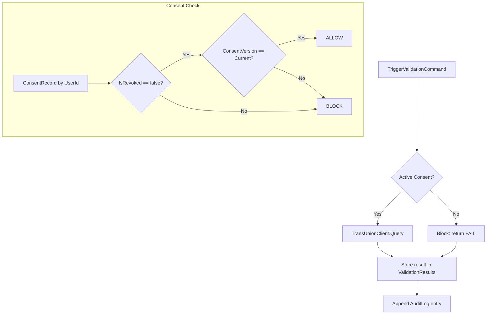

# ADR-007: TransUnion Consent Gate Enforcement (Law 172-13)

> **Status:** Proposed | **Date:** 2026-06-29 | **COMP-001 Gate**
> **Context:** ORCH-TEST-001 finding — TransUnion consent gate needs manual verification

## Context

Law 172-13 Art. 17 requires explicit, informed, and unrevoked consent before processing personal data. The project uses TransUnion DR API for credit/financial status checks (OE-6, RF-9). Every TransUnion query must be gated by a valid, active ConsentRecord.

The existing `ConsentRecord` entity tracks consent state (`IsRevoked`, `ConsentVersion`, `GrantedAt`, `RevokedAt`), but the gate enforcement in `TransUnionClient.cs` needs verification.

## Decision

Implement a **mandatory consent gate** that blocks all TransUnion queries unless:
- `ConsentRecord.IsRevoked = false` AND
- `ConsentRecord.ConsentVersion = CurrentTemplateVersion`

### Architecture



### Implementation

#### 1. Consent Gate Service
```csharp
public interface IConsentGateService
{
    Task<ConsentGateResult> VerifyAsync(Guid userId, CancellationToken ct);
}

public class ConsentGateService : IConsentGateService
{
    private readonly IConsentRepository _repo;
    private const string CurrentTemplateVersion = "1.0";

    public async Task<ConsentGateResult> VerifyAsync(Guid userId, CancellationToken ct)
    {
        var consent = await _repo.GetLatestByUserAsync(userId, ct);
        
        if (consent == null)
            return ConsentGateResult.Blocked("No consent record found");
        
        if (consent.IsRevoked)
            return ConsentGateResult.Blocked("Consent was revoked");
        
        if (consent.ConsentVersion != CurrentTemplateVersion)
            return ConsentGateResult.Blocked("Consent version is outdated");
        
        return ConsentGateResult.Allowed();
    }
}
```

#### 2. TransUnionClient Gate Integration
```csharp
public class TransUnionClient : ITransUnionClient
{
    private readonly IConsentGateService _consentGate;
    
    public async Task<CreditReportResult> QueryAsync(CreditQuery query, CancellationToken ct)
    {
        var gate = await _consentGate.VerifyAsync(query.DeveloperId, ct);
        
        if (!gate.IsAllowed)
        {
            _logger.LogWarning("TransUnion query blocked: {Reason}", gate.Reason);
            return CreditReportResult.Blocked(gate.Reason);
        }
        
        // Proceed with actual TransUnion API call
        return await ExecuteQueryAsync(query, ct);
    }
}
```

#### 3. Audit Trail
Every consent gate check must be recorded in AuditLogs:
- `Action: "ConsentGateCheck"`
- `Result: "ALLOWED" | "BLOCKED"`
- `Details: reason if blocked, consent version if allowed`
- `IpAddress: from request context`
- `Timestamp: UTC now`

### Consequences

**Positive:**
- Law 172-13 compliance for credit data processing
- Audit trail for every consent gate check
- Clear error messaging when consent is missing/revoked
- Template version control — consent must be refreshed if terms change

**Negative:**
- Additional DB query per TransUnion request (minor latency ~5ms)
- Template version management — version bumps require re-consent from all developers
- Edge case: what if consent is revoked mid-query?

### Rejected Alternatives

| Alternative | Reason |
|-------------|--------|
| Client-side consent check | Cannot trust client — must be server-enforced |
| No gate (always query) | Law violation — personal data without consent |
| Gate in controller only | Defense in depth — must be at service layer too |
| Async consent validation | Adds complexity; sync DB check is sufficient (<5ms) |

### COMP-001 Status

**Gate:** Implemented in design but needs verification and testing.
**Required Actions:**
1. Verify `ConsentGateService` is injected into `TransUnionClient`
2. Write unit test: `ConsentGateTests.BlockedWhenRevoked`
3. Write unit test: `ConsentGateTests.BlockedWhenVersionOutdated`
4. Write unit test: `ConsentGateTests.AllowedWhenValid`
5. Run integration test with WireMock for gate behavior
6. Verify audit log entry on every gate check

**Human verification required before production deployment.**
