---
# VeriFinca — QA Roadmap
> Source: qa_classification.json (14 defects) + TRD v3.0.0 (11 RF + 6 RNF = 17 requisitos formales) + QA audit externo (47 checklist items from external spreadsheet at /docs/qa-checklist-v1.xlsx) | Generated: 2026-06-29T20:00:00-04:00 | Updated: 2026-06-29T20:30:00-04:00 | By: DocWriter v1.0
> Skill: planning-with-files | codebase-memory-mcp: verified | SHA: 04c9f381247b28f42a4d526127dd40c30dd34946

## 🎯 GOAL

Transformar el informe QA externo (47 checklist items from /docs/qa-checklist-v1.xlsx — 9✅ / 30🟡 / 2❌ / 6❓), 14 defectos activos (4 P0, 7 P1, 5 P2) y 7 TC fallidos (TC-002..005, TC-010..012) en un roadmap ejecutable de **34 ítems** (21 WBS + 13 TEC) distribuidos en **6 fases**, con trazabilidad completa RF→OE, **3 gates humanos** (SEC-001, COMP-001, BUG-005) y **~50 gates de validación**.

| Métrica | Target | Medición |
|---------|--------|----------|
| Rutas funcionales | 4/4 P0 routes render | Vitest + Playwright smoke |
| E2E tests passing | 7/7 TC failures resolved | `playwright test --reporter=json` exit 0 |
| Seguridad | JWT HttpOnly + password policy + consent UI | Security integration tests |
| Cobertura frontend | 17 UI gaps cerradas | Playwright smoke tests |
| Cobertura tests | ≥ 80% Domain + Application | `dotnet test --coverage` |
| Violaciones ArchUnit | 0 | `dotnet test --filter ArchUnit` |
| CVE OWASP | 0 HIGH/CRITICAL | `dotnet list package --vulnerable` |
| post_task_loop.py | Score ≥ 60 | Evaluation script |

---

## 📍 CONTEXT

### Estado Actual

| Aspecto | Valor |
|---------|-------|
| **Arquitectura** | Clean Architecture (Domain → Application → Infrastructure → Api) |
| **Branch** | `feat-codebase-memory-mcp` (10 ahead of `develop`) |
| **OE Delivery** | 0/7 OEs fully delivered; todos diseñados en spec |
| **Backend** | 28 endpoints, CQRS con MediatR, FluentValidation |
| **Frontend** | React 19 + Vite 6 + TypeScript + Tailwind 4 — 40+ route pages |
| **Auth** | Flujo de registro funciona; 8 endpoints con `[Authorize]` comentado |
| **Agentes** | `architect-agent`, `developer-agent`, `reviewer-agent`, `compliance-agent`, `validation-workflow-agent` |
| **Seguridad** | OWASP Top 10 enforce; Law 172-13 (datos); Law 126-02 (comercio digital) |
| **CI/CD** | Pipeline 12 gates (build → test → coverage → archunit → semgrep → zap → deploy) |
| **MCP Mandate** | codebase-memory-mcp bootstrap mandatory cada sesión (§0 de AGENTS.md) |

### Cobertura de Requisitos

| Categoría | Count | Detalle |
|-----------|-------|---------|
| **Total Requisitos** | 47 | Mapeados RF-1 a RF-11 |
| ✅ Cubiertos | 9 | Auth core, project CRUD base, document upload básico |
| 🟡 Parcial | 30 | Backend existe, frontend faltante o UI de validación incompleta |
| ❌ Fallidos | 2 | Validación de registro falla, API de lista de proyectos regression |
| ❓ No Verificados | 6 | Consent records, integrity seal, credit check no probados E2E |

### Defectos Activos

| Severidad | Count | Ejemplos |
|-----------|-------|----------|
| 🔴 P0 — Critical | 4 | `/#/register` blank, `/#/proyectos` 404, `/#/dashboard` crash, `/#/legal` blank |
| 🟠 P1 — High | 7 | JWT en localStorage, sin política de contraseñas, sin validación email, stack traces expuestos, sin UI consentimiento, Precios redirect to login (BUG-005), 17 UIs backend sin frontend (FEAT-002), optimización bundle (PERF-001) |
| 🟡 P2 — Medium | 4 | Sin feedback fortaleza pwd, poor error UX, sin admin UI, sin manejo error red |

### TC Fallidos

| TC ID | Scope | Failure | Maps To |
|-------|-------|---------|---------|
| TC-002 | Register page | No renderiza | WBS-001 |
| TC-003 | Proyectos page | No renderiza | WBS-002 |
| TC-004 | Dashboard page | No renderiza | WBS-003 |
| TC-005 | Legal page | No renderiza | WBS-004 |
| TC-010 | Register→Login E2E | Flujo roto | WBS-005 |
| TC-011 | Project creation E2E | Flujo roto | WBS-006 |
| TC-012 | Document upload E2E | Flujo roto | WBS-006 |

### Coverage Gaps Frontend (19 endpoints sin UI / sin implementar)

| # | Endpoint Cluster | RF | OE | Prioridad |
|---|-----------------|----|----|-----------|
| 1 | Documentary Diagnosis UI — lista documentos requeridos vs recibidos | RF-2 | OE-1 | P1 |
| 2–4 | Document upload + OCR | RF-3 | OE-2, OE-3 | P1 |
| 5–7 | RI validation | RF-4 | OE-2, OE-3 | P1 |
| 8–10 | Catastro validation | RF-5 | OE-2, OE-5 | P1 |
| 11–13 | DGII validation | RF-6 | OE-2 | P1 |
| 14–15 | Georeferencing / Map | RF-7 | OE-5 | P1 |
| 16–18 | Credit verification (TransUnion) | RF-9 | OE-6 | P1 |
| 19 | Sello Digital — emit + QR display | RF-10 | OE-7 | P1 |

---

## 🔴 P0 — Critical (Bloqueantes)

Ítems que bloquean TODO el resto del trabajo. Las rutas deben renderizar antes de que cualquier E2E test o feature del frontend pueda ser validada.

| ID | Item | RF | OE | Layer | Agent | Blocker |
|----|------|----|----|-------|-------|---------|
| WBS-001 | Fix `/#/register` — error de aplicación, componente no renderiza | RF-1 | OE-1 | Frontend | developer-agent | — |
| WBS-002 | Fix `/#/proyectos` — página en blanco / error de carga | RF-1 | OE-1 | Frontend | developer-agent | — |
| WBS-003 | Fix `/#/dashboard` — crash al montar, vista post-login principal | RF-1 | OE-1 | Frontend | developer-agent | — |
| WBS-004 | Fix `/#/legal` — página en blanco, términos legales no visibles | RF-8 | OE-6 | Frontend | developer-agent | — |
| WBS-005 | Fix register E2E tests (TC-002, TC-010) | RF-1 | OE-1 | Frontend | developer-agent + validation-workflow-agent | WBS-001 |
| WBS-006 | Fix proy/dash E2E tests (TC-003..005, TC-011..012) | RF-3, RF-4 | OE-2, OE-3 | Frontend | developer-agent + validation-workflow-agent | WBS-002, WBS-003 |

**Gates Phase 0:** 4 route-smoke gates (1 por ruta) + 2 E2E gates (1 por test batch) = **6 gates**

**Estrategia de Rollback:** `git checkout BASELINE_SHA -- src/frontend/` si algún fix rompe rutas no relacionadas

**Max retries por ítem:** 3

---

## 🟠 P1 — High Priority

Ítems de seguridad, compliance y features críticas que desbloquean la validación completa del sistema.

| ID | Item | RF | OE | Layer | Agent | Blocker |
|----|------|----|----|-------|-------|---------|
| WBS-007 | Migrar JWT de localStorage a cookies HttpOnly | RF-1 | OE-7 | Backend + Frontend | compliance-agent | — |
| WBS-008 | Fix ruta pública `/#/precios` — redirige al login incorrectamente | RF-11 | OE-7 | Frontend | developer-agent | — |
| WBS-009 | Optimizar tiempo de carga (lazy loading, code splitting, bundles) | RNF-2 | General | Frontend | developer-agent | WBS-008 |
| WBS-010 | Agregar validación de email (Zod + FluentValidation) | RF-1 | OE-1 | Fullstack | developer-agent | — |
| WBS-011 | Implementar Problem Details error middleware (RFC 7807) | General | General | Backend API | developer-agent | — |
| WBS-012 | Reforzar política de contraseñas (min 8 + complejidad + OWASP common list) | RF-1 | OE-7 | Backend | compliance-agent | — |
| WBS-013 | Implementar UI de consentimiento Law 172-13 (términos + verificación crediticia) (7yr retention flag) | RF-8 | OE-6 | Frontend | developer-agent + compliance-agent | WBS-004 |
| WBS-014 | Construir 17 UIs faltantes para endpoints del backend | RF-3..RF-9 | OE-2..OE-6 | Frontend | developer-agent | WBS-002, WBS-003 |
| WBS-020 | Implementar endpoint `POST /projects/{id}/seal` — Sello Digital (Law 126-02, RSA-2048 + QR + guard chain: all PASS, no INVALID/MISSING, consent active) | RF-10 | OE-7 | Backend + Frontend | developer-agent + compliance-agent | WBS-013 |
| WBS-021 | Implementar RF-2 Documentary Diagnosis UI + Rules Engine — detectar documentos faltantes/incompletos según tipo de proyecto | RF-2 | OE-1 | Fullstack | developer-agent | WBS-014 |

### WBS-014 Desglose — 17 Pantallas UI

| # | Pantalla | RF | Endpoint Backend |
|---|----------|----|------------------|
| 1 | Panel de subida de documentos | RF-3 | `POST /projects/{id}/documents` |
| 2 | Visualizador de resultados OCR | RF-3 | `GET /projects/{id}/documents/{docId}/ocr` |
| 3 | Lista de estado de documentos | RF-3 | `GET /projects/{id}/documents` |
| 4 | Panel de validación RI | RF-4 | `POST /projects/{id}/validations/ri` |
| 5 | Resultados de validación RI | RF-4 | `GET /projects/{id}/validations/ri/{validationId}` |
| 6 | Historial de propiedad RI | RF-4 | `GET /projects/{id}/ri/history` |
| 7 | Panel de validación Catastro | RF-5 | `POST /projects/{id}/validations/catastro` |
| 8 | Vista de resultados Catastro | RF-5 | `GET /projects/{id}/validations/catastro/{validationId}` |
| 9 | Visor de mapa catastral | RF-5 | `GET /projects/{id}/catastro/map` |
| 10 | Formulario validación RNC DGII | RF-6 | `POST /projects/{id}/validations/dgii` |
| 11 | Resultados validación DGII | RF-6 | `GET /projects/{id}/validations/dgii/{validationId}` |
| 12 | Badge de estado RNC | RF-6 | `GET /projects/{id}/rnc-status` |
| 13 | Componente de mapa georreferenciación | RF-7 | `GET /projects/{id}/geo/coordinates` |
| 14 | Comparación GPS vs catastral | RF-7 | `POST /projects/{id}/geo/verify` |
| 15 | Diálogo de consentimiento (Law 172-13) | RF-8 | `POST /consent/record` |
| 16 | Panel de verificación crediticia | RF-9 | `POST /projects/{id}/credit-check` |
| 17 | Vista de resultados TransUnion | RF-9 | `GET /projects/{id}/credit-check/{checkId}` |

### WBS-020 Desglose — Sello Digital (Law 126-02)

| # | Componente | RF | Endpoint/Archivo |
|---|-----------|----|-----------------|
| 1 | `CertificationEngine` — RSA-2048 signing via Key Vault | RF-10 | `Infrastructure/Sealing/CertificationEngine.cs` |
| 2 | Issuance guard chain (all PASS, no INVALID/MISSING, consent active) | RF-10 | `Application/Handlers/IssueIntegritySealHandler.cs` |
| 3 | `POST /projects/{id}/seal` controller endpoint | RF-10 | `Api/Controllers/SealController.cs` |
| 4 | QR code generation embedding digital signature | RF-10 | `Infrastructure/Sealing/QrCodeGenerator.cs` |
| 5 | Seal issuance UI button + QR display component | RF-10 | `src/features/seal/` |
| 6 | `IssueIntegritySealGuardTests` (per AGENTS.md §10 requirement) | RF-10 | `tests/backend/UnitTests/Security/IssueIntegritySealGuardTests.cs` |

### WBS-021 Desglose — Documentary Diagnosis RF-2

| # | Componente | RF | Endpoint/Archivo |
|---|-----------|----|-----------------|
| 1 | Rules Engine — determinar documentos requeridos según tipo de proyecto | RF-2 | `Domain/Rules/DocumentRequirementRules.cs` |
| 2 | Diagnosis endpoint `GET /projects/{id}/documents/diagnosis` | RF-2 | `Api/Controllers/DiagnosisController.cs` |
| 3 | Diagnosis UI — lista de documentos esperados vs recibidos con estado | RF-2 | `src/features/diagnosis/` |
| 4 | Tests para Rules Engine (90% cobertura mínima Domain) | RF-2 | `tests/backend/UnitTests/Domain/` |

**Gates Phase 1:** 10 item-gates (1 por WBS) + 3 human gates + 27 sub-gates (17 UIs + 6 seal + 4 diagnosis) = **40 gates**

---

## 🟡 P2 — Medium Priority

Mejoras de UX, herramientas de administración y mecanismos de feedback. No bloqueantes para release pero requeridas para producción.

| ID | Item | RF | OE | Layer | Agent | Blocker |
|----|------|----|----|-------|-------|---------|
| WBS-015 | Admin UI — gestión de usuarios, reglas, monitoreo, log de auditoría | RF-1 | General | Frontend | developer-agent | — |
| WBS-016 | Indicador de fortaleza de contraseña + validación en tiempo real | RF-1 | OE-7 | Frontend | developer-agent | — |
| WBS-017 | ErrorBoundary + hook `useApiErrorHandler` para feedback al usuario | General | General | Frontend | developer-agent | WBS-011 |
| WBS-018 | Validación de longitud mínima de contraseña (≥ 8) en formulario | RF-1 | OE-7 | Frontend | developer-agent | — |
| WBS-019 | Manejo de errores de red / offline (banner + reintento) | General | General | Frontend | developer-agent | — |

**Gates Phase 2:** 5 item-gates (1 por WBS) = **5 gates**

---

## 🟢 P3 — Tech Debt

Mejoras no funcionales, accesibilidad, rendimiento y fortalecimiento de CI/CD. No bloqueantes pero necesarias para producción enterprise.

| ID | Item | RF | OE | Layer | Agente | Dependencia |
|----|------|----|----|-------|--------|-------------|
| TEC-001 | Agregar etiquetas ARIA y roles a componentes críticos (Login, Register, Proyectos) | RNF-6 | General | Frontend | developer-agent | — |
| TEC-002 | Ajustar breakpoints responsive para mobile (< 640px) en layout principal | RNF-6 | General | Frontend | developer-agent | — |
| TEC-003 | Pruebas de carga con k6 o Artillery en endpoints críticos (POST /auth, GET /projects) | RNF-2 | General | Backend | devops-specialist | — |
| TEC-004 | Auditoría WCAG 2.2 completa en rutas públicas (Login, Register, Precios, Legal) | RNF-6 | General | Frontend | compliance-agent | — |
| TEC-005 | Implementar rotación de refresh tokens (single-use, 30-day TTL, rotated on use) | RF-1 | OE-7 | Backend | compliance-agent | WBS-007 |
| TEC-006 | Configurar Rate Limiting (60 req/min PUBLIC, 300 req/min autenticado) | RNF-1 | OE-7 | Backend API | compliance-agent | — |
| TEC-007 | Hardening CSP: `default-src 'self'`, bloquear `unsafe-inline`, report-uri | RNF-1 | OE-7 | Backend API | compliance-agent | — |
| TEC-008 | Agregar versionado de API (`/api/v1/`) con ruteo por convención | RF-11 | General | Backend API | developer-agent | — |
| TEC-009 | Expandir cobertura Playwright: tests de validación, consent, seal y público | General | General | Test | developer-agent | WBS-005, WBS-006 |
| TEC-010 | Configurar gate de SonarCloud en CI (Quality Gate: cobertura ≥ 80%, duplicación < 3%) | General | General | CI/CD | devops-specialist | — |
| TEC-011 | Implementar DataRetentionPurgeJob — Law 172-13 TTL enforcement (30d TransUnion, 90d docs, 7yr ConsentRecords/AuditLogs) + Always Encrypted compliance | RNF-5 | OE-6 | Backend Infrastructure | compliance-agent | WBS-013 |
| TEC-012 | Availability monitoring + health checks (RNF-3 — 99.2% uptime target). Health endpoint `/health`, startup probe, liveness probe, App Insights alerts | RNF-3 | General | Backend API + Infra | devops-specialist | — |
| TEC-013 | Load testing target with k6 (RNF-4 — 500 concurrent users) en endpoints críticos: auth, projects list, seal verification | RNF-4 | General | Backend API + Infra | devops-specialist | TEC-012 |

**Gates Phase 3:** 13 item-gates (1 por TEC) = **13 gates**

---

## 🔄 WORKFLOW — Diagrama de Flujo por Fases

```mermaid
flowchart TD
    START([QA Roadmap Start]) --> BASELINE[Record BASELINE_SHA]
    BASELINE --> RUN_BASELINE[Run Baseline Tests]
    RUN_BASELINE --> GATE0{GATE 0: Baseline captured}

    %% Phase 0: Fix 4 P0 Routes (Parallel)
    GATE0 -->|PASS| P0[Phase 0: Fix 4 P0 Routes]
    P0 --> P0A[WBS-001: /#/register]
    P0 --> P0B[WBS-002: /#/proyectos]
    P0 --> P0C[WBS-003: /#/dashboard]
    P0 --> P0D[WBS-004: /#/legal]
    P0A & P0B & P0C & P0D --> G1{GATE 1: 4 routes render<br/>Vitest + Playwright}
    G1 -->|FAIL| ROLLBACK
    G1 -->|PASS| P1[Phase 1: Fix E2E Tests]

    %% Phase 1: Fix E2E Tests (Sequential)
    P1 --> P1A[WBS-005: Register E2E tests<br/>TC-002, TC-010]
    P1A --> P1B[WBS-006: Proy/Dash E2E tests<br/>TC-003..005, TC-011..012]
    P1B --> G2{GATE 2: 7/7 E2E tests pass}
    G2 -->|FAIL| ROLLBACK
    G2 -->|PASS| C0[Phase 0-1 Complete]

    %% Phase 2: JWT + Password + Compliance (Human Gate)
    C0 --> HG1{{HUMAN GATE 1<br/>SEC-001: JWT → HttpOnly<br/>Auth regression risk}}
    HG1 -->|DENY| STOP1[STOP — Human decision required]
    HG1 -->|APPROVE| P2[Phase 2: Security & Compliance]
    P2 --> P2A[WBS-007: JWT HttpOnly migration]
    P2A --> P2B[WBS-012: Password policy]
    P2B --> P2C[WBS-010: Email validation]
    P2C --> P2D[WBS-011: Problem Details middleware]
    P2D --> P2E[WBS-008: Precios public route]
    P2E --> HG2{{HUMAN GATE 2<br/>BUG-005: Public API contract<br/>GET /public/* endpoints}}
    HG2 -->|DENY| STOP2[STOP — Human decision required]
    HG2 -->|APPROVE| G3{GATE 3: P1 security tests pass}
    G3 -->|FAIL| ROLLBACK
    G3 -->|PASS| C1[Phase 2 Security Complete]

    %% Phase 2b: Features + 17 UIs
    C1 --> P2B_START[Phase 2b: Features & 17 UIs]
    P2B_START --> P2B_A[WBS-009: Precios performance]
    P2B_A --> HG3{{HUMAN GATE 3<br/>COMP-001: Consent Records UI<br/>Law 172-13 compliance}}
    HG3 -->|DENY| STOP3[STOP — Human decision required]
    HG3 -->|APPROVE| P2B_B[WBS-013: Consent UI dialog]
    P2B_B --> P2B_C[WBS-014: 17 frontend UIs]
    P2B_C --> P2B_D[WBS-020: RF-10 Integrity Seal<br/>RSA-2048 + QR + Law 126-02]
    P2B_D --> P2B_E[WBS-021: RF-2 Documentary Diagnosis<br/>UI + Rules Engine]
    P2B_E --> G4{GATE 4: Seal + Diagnosis + 17 UIs pass}
    G4 -->|FAIL| ROLLBACK
    G4 -->|PASS| C2[Phase 2b Complete]

    %% Phase 3: P2 UX Features
    C2 --> P3[Phase 3: P2 UX & Admin]
    P3 --> P3A[WBS-015: Admin UI]
    P3A --> P3B[WBS-016: Password strength]
    P3B --> P3C[WBS-017: Error feedback UI]
    P3C --> P3D[WBS-018: Password length]
    P3D --> P3E[WBS-019: Network error handling]
    P3E --> G5{GATE 5: P2 UX tests pass}
    G5 -->|FAIL| ROLLBACK
    G5 -->|PASS| C3[Phase 3 Complete]

    %% Tech Debt
    C3 --> TEC[Phase 4: Tech Debt]
    TEC --> TEC_A[TEC-001..013: 13 items]
    TEC_A --> G6{GATE 6: TEC items verified}

    %% Final Verification
    G6 --> FINAL[Final Verification]
    FINAL --> T1[dotnet test --configuration Release]
    T1 --> T2[pnpm vitest --coverage]
    T2 --> T3[playwright test --reporter=json]
    T3 --> T4[dotnet test --filter ArchUnit]
    T4 --> T5[Security scan: CVE + Semgrep + Secret]
    T5 --> PT[post_task_loop.py]
    PT --> G7{GATE 7: All green?}
    G7 -->|FAIL| FIX[Address HIGH issues]
    FIX --> PT
    G7 -->|PASS| PROG[Update progress.md]
    PROG --> DONE([✅ QA Roadmap Complete])

    ROLLBACK --> RB([⛔ Rollback to BASELINE_SHA])

    classDef phase fill:#1a56db,color:#fff
    classDef gate fill:#f59e0b,color:#000
    classDef human fill:#dc2626,color:#fff
    classDef rollback fill:#991b1b,color:#fff
    classDef done fill:#059669,color:#fff
    classDef stop fill:#dc2626,color:#fff,stroke-dasharray: 5 5

    class P0,P1,P2,P2B_START,P3,TEC phase
    class GATE0,G1,G2,G3,G4,G5,G6,G7 gate
    class HG1,HG2,HG3 human
    class ROLLBACK,RB rollback
    class DONE done
    class STOP1,STOP2,STOP3 stop
```

### Fases Resumidas

| Fase | Ítems | Gates | Humanos | Duración Est. |
|------|-------|-------|---------|---------------|
| 0 — Fix Routes (paralelo) | WBS-001..004 | 4 smoke + 1 phase | — | 1–2d |
| 1 — Fix E2E Tests (secuencial) | WBS-005..006 | 2 E2E + 1 phase | — | 1–2d |
| 2 — Seguridad & Compliance | WBS-007..012 | 6 item + 1 phase | SEC-001, BUG-005 | 3–5d |
| 2b — Features, Seal & Diagnosis | WBS-009, 013..014, 020..021 | 5 item + 1 phase | COMP-001 | 7–14d |
| 3 — UX & Admin | WBS-015..019 | 5 item + 1 phase | — | 3–5d |
| 4 — Tech Debt | TEC-001..013 | 13 item + 1 phase | — | 6–10d |
| **Final Verification** | Todos | 6 final gates | — | 1d |
| **TOTAL** | **34 ítems** | **~50 gates** | **3 humanos** | **~22–39d** |

---

## 🚧 BLOCKERS & DECISIONS

### Bloqueos Activos

| Blocker ID | Bloquea | Tipo | Estado | Resolución |
|------------|---------|------|--------|------------|
| WBS-001 | WBS-005 | Dependencia | 🔴 Activo | Ruta register debe renderizar antes que E2E register tests |
| WBS-002, WBS-003 | WBS-006, WBS-014 | Dependencia | 🔴 Activo | Rutas proyectos/dashboard deben renderizar antes que tests/UIs |
| WBS-004 | WBS-013 | Dependencia | 🔴 Activo | Ruta legal debe funcionar antes que UI de consentimiento |
| WBS-008 | WBS-009 | Dependencia | 🟡 Activo | Fix ruta precios antes de optimizar performance |
| WBS-011 | WBS-017 | Dependencia | 🟡 Activo | Error middleware antes de UI de error feedback |

### Decisiones — Gates Humanos

| Gate ID | Decisión | Requerido por | Estado |
|---------|----------|---------------|--------|
| SEC-001 | Aprobar migración JWT de localStorage a cookies HttpOnly | Inicio Phase 2 | ⏳ Pendiente |
| COMP-001 | Aprobar UI de ConsentRecords + extensión de schema | Inicio Phase 2b | ⏳ Pendiente |
| BUG-005 | Confirmar que fix de ruta Precios no afecta endpoints `GET /public/*` | Inicio Phase 2 | ⏳ Pendiente |

### Riesgos Clave

| Riesgo | Probabilidad | Impacto | Mitigación |
|--------|-------------|---------|------------|
| Migración JWT rompe sesiones existentes | Alta | Crítico | Período de gracia + endpoint de migración |
| Schema ConsentRecords bloqueado por compliance | Media | Alto | Construir UI con schema actual primero |
| Rutas no son la única causa de fallo E2E | Media | Alto | Staged: fix rutas primero, luego diagnosticar |
| 17 UIs revelan gaps en API backend | Media | Medio | Buffer de 2 semanas en el schedule |
| post_task_loop.py score < 60 | Baja | Medio | Warning only — documentar en findings.md |

---

## ⏭️ NEXT 3 ACTIONS

### Acción 1: [developer-agent] Ejecutar Phase 0 — Fix 4 P0 Routes (Paralelo)

| WBS | Ruta | Método | Test Gate |
|-----|------|--------|-----------|
| WBS-001 | `/#/register` | TDD: Vitest test → Fix → Playwright smoke | `pnpm vitest --run src/pages/auth/__tests__/RegisterPage.test.tsx` |
| WBS-002 | `/#/proyectos` | TDD: Vitest test → Fix → Playwright smoke | `pnpm vitest --run src/pages/projects/__tests__/ProjectsPage.test.tsx` |
| WBS-003 | `/#/dashboard` | TDD: Vitest test → Fix → Playwright smoke | `pnpm vitest --run src/pages/dashboard/__tests__/DashboardPage.test.tsx` |
| WBS-004 | `/#/legal` | TDD: Vitest test → Fix → Playwright smoke | `pnpm vitest --run src/pages/legal/__tests__/LegalPage.test.tsx` |

**Rollback:** `git checkout BASELINE_SHA -- src/frontend/`
**Gate:** `pnpm build` exit 0 + 4 Vitest route tests pass + 4 Playwright smoke tests pass
**Max retries:** 3 por ruta

### Acción 2: [compliance-agent] Auditar Plan de Migración JWT

- **Input:** Análisis de SEC-001 (JWT en localStorage → HttpOnly cookies)
- **Output:** Propuesta de migración con:
  - Período de gracia (ambos métodos soportados por 48h)
  - Endpoint de migración: `POST /auth/migrate-session`
  - Plan de rollback si algo falla
- **Human Gate:** Presentar a humano para aprobación SEC-001
- **Gate:** Documento de plan aprobado por humano

### Acción 3: [architect-agent] Mapear Componentes para 17 UIs

- **Input:** WBS-014 spec + TRD §9 (API endpoints)
- **Output:** 
  - Lista de 17 componentes React con props/state definidos
  - Zod schemas para cada formulario
  - TanStack Query keys para cada endpoint
  - Mock handlers (MSW) para tests
- **Gate:** Spec revisada por reviewer-agent + arquitectura consistente con diseño actual

### Acción 4 (Post-Phase 0): [compliance-agent + developer-agent] Implementar WBS-020 (RF-10 Sello Digital) + WBS-021 (RF-2 Documentary Diagnosis)

- **Input:** TRD §9 (seal endpoint), TRD §5 (documentary diagnosis)
- **Output:**
  - WBS-020: `CertificationEngine` RSA-2048 signing, `POST /projects/{id}/seal`, QR gen, UI button + display, tests
  - WBS-021: Document requirement Rules Engine, diagnosis endpoint + UI
  - Anotar `(Law 126-02)` y `(Law 172-13)` explícitamente en cada ítem
- **Gate:** dotnet test + vitest + E2E seal flow tests

---

## APPENDIX A: WBS — Source Mapping

| WBS ID | Source ID | Descripción | Severidad | TC IDs | Phase |
|--------|-----------|-------------|-----------|--------|-------|
| WBS-001 | BUG-001 | Ruta `/#/register` no funcional | Critical | TC-002 | 0 |
| WBS-002 | BUG-002 | Ruta `/#/proyectos` no funcional | Critical | TC-003 | 0 |
| WBS-003 | BUG-003 | Ruta `/#/dashboard` no funcional | Critical | TC-004 | 0 |
| WBS-004 | BUG-004 | Página `/#/legal` en blanco | Critical | TC-005 | 0 |
| WBS-005 | TST-001 | Pruebas E2E registro fallan (TC-002, TC-010) | Critical | TC-002, TC-010 | 1 |
| WBS-006 | TST-002 | Pruebas E2E proyecto/dashboard fallan (TC-003..005, TC-011..012) | Critical | TC-003..005, TC-011..012 | 1 |
| WBS-007 | SEC-001 | JWT almacenado en localStorage — riesgo XSS | High | — | 2 |
| WBS-008 | BUG-005 | Página Precios redirige al login | High | — | 2 |
| WBS-009 | PERF-001 | Tiempo de carga excesivo (>5s) | High | — | 2b |
| WBS-010 | BUG-006 | Falta validación de email en registro | High | — | 2 |
| WBS-011 | BUG-007 | Respuestas de error genéricas sin detalle | High | — | 2 |
| WBS-012 | SEC-002 | Política de contraseñas débil | High | — | 2 |
| WBS-013 | COMP-001 | UI de consentimiento Law 172-13 no implementada | High | — | 2b |
| WBS-014 | FEAT-002 | 17 endpoints del backend sin UI frontend | High | — | 2b |
| WBS-015 | FEAT-001 | Módulo de administración (Admin UI) no implementado | Medium | — | 3 |
| WBS-016 | BUG-008 | Falta validación de contraseña en formulario | Medium | — | 3 |
| WBS-017 | BUG-009 | Falta feedback de error al usuario | Medium | — | 3 |
| WBS-018 | BUG-010 | Falta validación longitud mínima contraseña | Medium | — | 3 |
| WBS-019 | BUG-011 | Falta manejo de errores de red / offline | Medium | — | 3 |
| WBS-020 | FEAT-003 | Sello Digital RF-10 (Law 126-02) — endpoint, guard chain, QR | High | — | 2b |
| WBS-021 | FEAT-004 | Documentary Diagnosis RF-2 — Rules Engine + UI | High | — | 2b |

---

## APPENDIX B: OE Traceability Matrix

| WBS ID | OE-1 | OE-2 | OE-3 | OE-4 | OE-5 | OE-6 | OE-7 |
|--------|------|------|------|------|------|------|------|
| WBS-001 | x | | | | | | |
| WBS-002 | x | | | | | | |
| WBS-003 | x | | | | | | |
| WBS-004 | | | | | | x | |
| WBS-005 | x | | | | | | |
| WBS-006 | | x | x | | | | |
| WBS-007 | | | | | | | x |
| WBS-008 | | | | | | | x |
| WBS-009 | — | — | — | — | — | — | — |
| WBS-010 | x | | | | | | |
| WBS-011 | — | — | — | — | — | — | — |
| WBS-012 | | | | | | | x |
| WBS-013 | | | | | | x | |
| WBS-014 | | x | x | x | x | x | |
| WBS-015 | x | x | x | x | x | x | x |
| WBS-016 | | | | | | | x |
| WBS-017 | — | — | — | — | — | — | — |
| WBS-018 | | | | | | | x |
| WBS-019 | — | — | — | — | — | — | — |
| WBS-020 | | | | | | | x |
| WBS-021 | x | | | | | | |

| TEC ID | OE-1 | OE-2 | OE-3 | OE-4 | OE-5 | OE-6 | OE-7 |
|--------|------|------|------|------|------|------|------|
| TEC-001 | x | — | — | — | — | — | — |
| TEC-002 | — | — | — | — | — | — | — |
| TEC-003 | — | x | — | — | — | — | — |
| TEC-004 | x | — | — | — | — | — | — |
| TEC-005 | | | | | | | x |
| TEC-006 | | | | | | | x |
| TEC-007 | | | | | | | x |
| TEC-008 | — | — | — | — | — | — | — |
| TEC-009 | — | x | x | x | — | x | x |
| TEC-010 | — | — | — | — | — | — | — |
| TEC-011 | | | | | | x | |
| TEC-012 | — | — | — | — | — | — | — |
| TEC-013 | — | — | — | — | — | — | — |

**Leyenda:** `x` = contribuye directamente a este OE | `—` = item no-funcional (General) sin OE específico | (blank) = sin contribución directa

---

## APPENDIX C: Total Gate Count

| Tipo de Gate | Cantidad | Detalle |
|-------------|----------|---------|
| 🟢 Phase Gates (fase completa) | 8 | GATE0..GATE7 |
| 🔵 Item Gates (por WBS/TEC) | 21 | WBS-001..021 |
| 🟣 Sub-item Gates (17 UIs + 6 seal + 4 diagnosis) | 27 | WBS-014, WBS-020, WBS-021 desglose |
| 🔴 Human Gates | 3 | SEC-001, COMP-001, BUG-005 |
| 🟤 Tech Debt Item Gates (TEC) | 13 | TEC-001..013 |
| 🟤 Final Verification Gates | 6 | dotnet test, vitest, playwright, ArchUnit, security, post_task_loop |
| **TOTAL** | **78** | |
| **Unique (sin sub-ítems)** | **~50** | Para tracking en progress.md |

---

> **Next Review:** Al completar Phase 0 | **Owner:** validation-workflow-agent | **Actualizar:** progress.md + findings.md
