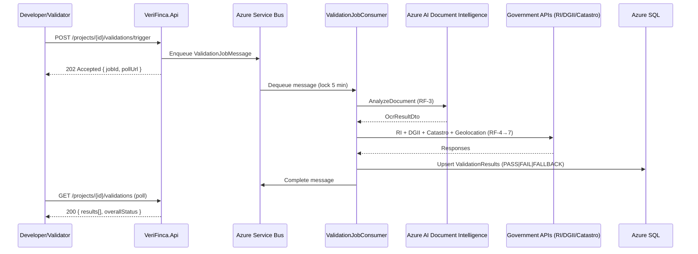

# Technical Requirements Document (TRD): VeriFinca

> **Version:** 3.0.0 | **Date:** 2026-05-25 | **Status:** Engineering Review
> **Stack:** ASP.NET Core 8 (Clean Architecture) · React 19 + TypeScript + Vite
> **Infrastructure:** Azure SQL · Azure Blob Storage · Azure Service Bus · Azure AI Document Intelligence · Azure Key Vault · Azure Application Insights

***

## 1. System Architecture

### 1.1 Layer Structure

```
Client (React 19 SPA)
        │ HTTPS REST / JWT
        ▼
[Api Layer – ASP.NET Core 8]
        │
[Application Layer – CQRS / MediatR]
        │
[Domain Layer – Entities / Interfaces]
        │
[Infrastructure Layer – EF Core / External APIs / Azure SDKs]
        │
        ├── Azure SQL (relational data)
        ├── Azure Blob Storage (documents / seals)
        ├── Azure Service Bus (async validation queue)
        └── Azure Key Vault (secrets / signing keys)
```

### 1.2 Project Directory Tree (Enforced Clean Architecture)

```
src/
├── VeriFinca.Domain/
│   ├── Entities/             # Project, Document, ConsentRecord, IntegritySeal, AuditLog
│   ├── Enums/                # ValidationStatus, DocumentType, Role, AlertCode
│   ├── Interfaces/           # IProjectRepository, ISealRepository, IConsentRepository
│   └── Exceptions/           # DomainException, ConsentRequiredException, DuplicateMatriculaException
│
├── VeriFinca.Application/
│   ├── Commands/             # RegisterProjectCommand, IssueIntegritySealCommand, TriggerValidationCommand
│   ├── Queries/              # GetProjectQuery, GetValidationResultsQuery, GetDiagnosisQuery
│   ├── Handlers/             # One handler class per Command/Query (no shared handlers)
│   ├── DTOs/                 # Request / Response records (C# records – immutable)
│   ├── Validators/           # FluentValidation per DTO (one class per DTO)
│   └── Interfaces/           # IOcrService, IGovernmentApiService, ISealingService, IConsentService
│
├── VeriFinca.Infrastructure/
│   ├── Persistence/          # AppDbContext, Migrations/, Repositories/
│   ├── ExternalApis/         # RiClient, DgiiClient, CatastroClient, TransUnionClient (Polly retry)
│   ├── Messaging/            # ServiceBusPublisher, ValidationJobConsumer (IHostedService)
│   ├── Ocr/                  # AzureDocumentIntelligenceService (implements IOcrService)
│   ├── Sealing/              # CertificationEngine (Key Vault RSA-2048 signing)
│   └── Security/             # JwtService, KeyVaultSecretProvider (Managed Identity)
│
├── VeriFinca.Api/
│   ├── Controllers/          # AuthController, ProjectsController, ValidationController, PublicController
│   ├── Middleware/           # ErrorHandlingMiddleware, RateLimitMiddleware, SecurityHeadersMiddleware
│   ├── Filters/              # RbacAuthorizationFilter
│   └── Program.cs
│
└── VeriFinca.Tests/
    ├── Unit/                 # xUnit + Moq – Domain logic, Rules Engine, CertificationEngine guards
    ├── Integration/          # TestContainers (SQL Server) + WireMock.NET (external APIs)
    └── Security/             # OWASP ZAP headless scan scripts
```

**Boundary rule enforced via `dotnet-archunit`:**
- `Api` → `Application` only (never `Infrastructure` or `Domain` directly).
- `Application` → `Domain` only (never `Infrastructure`).
- `Infrastructure` → `Domain` and `Application.Interfaces` only.
```

### 1.3 RBAC Roles

| Role | Scope |
|---|---|
| `ADMIN` | All modules + rule configuration + audit + requeue DLQ |
| `DEVELOPER` | Own projects: register, upload documents, consent, read own validations |
| `VALIDATOR` | Trigger all validations, review, approve seal |
| `PUBLIC` | RF-11 – QR seal lookup only (unauthenticated, rate-limited) |

***

## 2. Machine-First Architecture Artifacts

Every complex feature **must** begin with updating machine-readable documents before any code is written. This prevents context drift and agent hallucinations in large codebases.

### 2.1 Mandatory Artifacts

| Artifact | File | Required Before |
|---|---|---|
| C4 Context Diagram | `ARCHITECTURE.md` | Any new external integration |
| Mermaid Flowchart | `ARCHITECTURE.md` | Any new validation flow or business rule change |
| Mermaid Sequence Diagram | `ARCHITECTURE.md` | Any async flow or multi-service interaction |
| ADR | `ADR/ADR-NNN-title.md` | Any architectural decision (library choice, pattern change, API design) |
| AGENTS.md | `AGENTS.md` | Repository setup and onboarding of new AI agents |

### 2.2 ADR Template (`ADR/ADR-NNN-title.md`)

```markdown
# ADR-NNN: [Decision Title]

**Date:** YYYY-MM-DD
**Status:** Proposed | Accepted | Deprecated | Superseded by ADR-XXX

## Context
[What is the problem or situation that requires a decision?]

## Decision
[What was decided and why?]

## Consequences
- **Positive:** [Benefits]
- **Negative:** [Trade-offs or risks introduced]
- **Risks:** [What could go wrong and the mitigation]
```

### 2.3 AGENTS.md Contract

`AGENTS.md` is the repository constitution for all AI agents. It must define:

```markdown
## Build Commands
- `dotnet build` — compile all projects
- `dotnet test` — run unit + integration tests
- `dotnet ef migrations add [Name]` — add EF migration

## Architecture Invariants
- Never write raw SQL. Use EF Core parameterized queries only.
- Never add secrets to appsettings.json. All secrets live in Azure Key Vault.
- Never bypass FluentValidation. All DTOs must have a registered validator.
- Always update ARCHITECTURE.md Mermaid diagrams before implementing a new flow.

## Test Gates
- Minimum 80% coverage on Application and Domain layers.
- Zero failing tests before any commit.
```

### 2.4 MCP Server Integration Rules

MCP (Model Context Protocol) servers must be connected to the IDE agent for live-data access. **Never let an agent guess schema or PR state — always provide a live tool.**

| MCP Server | When to Connect | Purpose |
|---|---|---|
| **GitHub MCP** | PRs, Issues, branch review | Agent reads actual PR diff and comments instead of guessing state |
| **Azure SQL / MCP-compatible DB** | Schema-related tasks | Agent reads live `AppDbContext` migrations to prevent hallucinated columns |
| **Stitch MCP** | UI/component tasks | Agent pulls VeriFinca design tokens directly from Stitch |
| **Azure Key Vault MCP** | Secret audit tasks | Agent validates Key Vault secret inventory without reading `.env` files |

**Rule:** If an IDE agent task involves reading existing data (schema, issue state, design tokens), the corresponding MCP server **must** be active. Failure to connect results in a **context-blind agent** and is the primary cause of Zombie Reverts.

***

## 3. Asynchronous Validation Architecture (Azure Service Bus)

All OCR and government API checks are **decoupled from the HTTP request cycle** via **Azure Service Bus**. No long-running external call may block an HTTP response.

### 3.1 Async Validation Flow



### 3.2 Service Bus Queue Configuration

| Property | Value |
|---|---|
| Queue name | `verifinca-validation-jobs` |
| Max delivery count | 3 (then → Dead-Letter Queue) |
| Lock duration | 5 minutes |
| Message TTL | 24 hours |
| Dead-letter queue | `verifinca-validation-jobs/$DeadLetterQueue` |

### 3.3 Message Envelope Schema

```json
{
  "messageId": "<UUID>",
  "projectId": "<UUID>",
  "triggeredBy": "<userId>",
  "enqueuedAt": "ISO8601",
  "steps": ["OCR", "RI", "CATASTRO", "DGII", "GEOLOCATION"],
  "correlationId": "<traceId>"
}
```

### 3.4 Dead-Letter Handling

Messages exceeding `MaxDeliveryCount` are routed to the DLQ. `Application Insights` emits custom event `ValidationJobDeadLettered`. Manual requeue: `POST /admin/validations/requeue/{messageId}` (ADMIN role only).

***

## 4. RF-3 – Integrity Validation (Azure AI Document Intelligence)

**Mandated provider:** `Azure AI Document Intelligence` (formerly Form Recognizer).
**SDK:** `Azure.AI.FormRecognizer` v4+ via `Azure.AI.DocumentAnalysis`.
**Auth:** Managed Identity → Key Vault secret `verifinca-docai-key`.
**Endpoint call:** `AnalyzeDocumentAsync(modelId, blobUrl)` — custom-trained model per document type; fallback to `prebuilt-document` if custom model unavailable.
**Confidence threshold:** Fields with `Confidence < 0.85` are treated as absent and trigger alerts.

### 4.1 Extracted Fields per Document Type

| Document | Required Fields |
|---|---|
| `TITULO_PROPIEDAD` | `owner_name`, `matricula`, `issue_date`, `notary_signature` |
| `PLANO_CATASTRAL` | `cadastral_designation`, `area_m2`, `surveyor_stamp`, `approval_date` |
| `CERTIFICACION_DGII` | `rnc`, `company_name`, `issue_date`, `compliance_status` |
| `PERMISO_CONSTRUCCION` | `permit_number`, `municipality`, `issue_date`, `expiry_date`, `official_seal` |
| `ESTADO_FINANCIERO` | `company_name`, `auditor_signature`, `period_end_date`, `total_assets` |

### 4.2 OCR Alert Codes

| Code | Condition |
|---|---|
| `DOC_INVALID_SIGNATURE` | Mandatory signature field absent or `Confidence < 0.85` |
| `DOC_INCOMPLETE_FIELDS` | Required OCR fields empty |
| `DOC_INCONSISTENCY` | OCR extracted value mismatches `Projects` record |
| `DOC_DUPLICATE` | SHA-256 hash matches existing document in system |

Raw OCR output is persisted as `Documents.OcrResultJson` (immutable after first write).

***

## 5. Azure Key Vault – Secret Inventory

All secrets, signing keys, and certificates are stored exclusively in **Azure Key Vault**. Zero secrets in environment variables, `appsettings.json`, Docker images, or source code.

**Access pattern:** `Azure.Security.KeyVault.Secrets` SDK via Managed Identity. Secrets cached in `IMemoryCache` with 5-minute TTL.

| Secret Name | Type | Usage |
|---|---|---|
| `verifinca-jwt-secret` | Secret | JWT HMAC-SHA256 signing key |
| `verifinca-rsa-private-key` | Key (RSA-2048) | Integrity Seal digital signature (Law 126-02 Art. 32) |
| `verifinca-rsa-public-key` | Key (RSA-2048) | Published at `/public/.well-known/signing-key.pem` |
| `verifinca-db-connectionstring` | Secret | Azure SQL connection string |
| `verifinca-servicebus-connectionstring` | Secret | Azure Service Bus connection string |
| `verifinca-ri-apikey` | Secret | Registro Inmobiliario API key |
| `verifinca-transunion-apikey` | Secret | TransUnion DR API key |
| `verifinca-docai-key` | Secret | Azure AI Document Intelligence subscription key |
| `verifinca-storage-key` | Secret | Azure Blob Storage access key |

### 5.1 Encryption

| Scope | Method |
|---|---|
| Azure SQL at rest | AES-256 via TDE – customer-managed key in Key Vault |
| Blob Storage at rest | AES-256 via SSE – customer-managed key in Key Vault |
| In transit | TLS 1.2+ enforced at Azure App Service level |
| Passwords | BCrypt (cost factor 12) |
| JWT | HMAC-SHA256; access token TTL: 1 hour; refresh token TTL: 30 days (single-use, rotated) |

***

## 6. Shift-Left Security & Compliance (Zero Trust)

Security is not a post-build audit. It is a **pre-implementation gate** enforced at every layer.

### 6.1 Failing-Security-Test-First Loop

For every new endpoint or business rule:
1. **Write a security test that proves the vulnerability exists** (e.g., IDOR on `/projects/{id}`, missing consent guard on credit check).
2. **Confirm the test fails** (red).
3. **Implement the fix**.
4. **Confirm the test passes** (green).
5. Commit only after both functional and security tests are green.

### 6.2 OWASP Top 10 Enforcement Checklist

| OWASP Risk | VeriFinca Mitigation | Enforced In |
|---|---|---|
| A01 – Broken Access Control | RBAC policy per endpoint; IDOR tests in integration suite | `RbacAuthorizationFilter` + Tests |
| A02 – Cryptographic Failures | AES-256 TDE; TLS 1.2+; BCrypt passwords; RSA-2048 seals | Key Vault + App Service config |
| A03 – Injection | FluentValidation on all DTOs; EF Core parameterized queries only | `Application/Validators/` |
| A04 – Insecure Design | ADR required for all data-access patterns; schema review gate in CI | `ADR/` + SonarCloud gate |
| A05 – Security Misconfiguration | Security headers middleware; no stack traces in production errors | `SecurityHeadersMiddleware` |
| A06 – Vulnerable Components | `dotnet-outdated` scan in CI; Dependabot alerts enabled | GitHub Actions gate |
| A07 – Auth & Session Failures | JWT + refresh rotation; 2FA mandatory for ADMIN/VALIDATOR | `JwtService` |
| A08 – Software Integrity Failures | SHA-256 hash on all uploaded documents; signed release artifacts | `Documents.BlobSha256` |
| A09 – Logging Failures | Structured logging on all auth events and validation outcomes | Application Insights (see §11) |
| A10 – SSRF | Whitelist-only outbound HTTP (government API domains only) | `HttpClientFactory` base URL config |

### 6.3 Input Validation Gates (FluentValidation)

- All incoming DTOs validated **before** hitting MediatR handlers.
- File uploads: MIME whitelist (`application/pdf`, `image/jpeg`, `image/png`), max size 20 MB, virus scan via Azure Defender for Storage.
- RNC regex: `/^\d{1}-\d{2}-\d{5}-\d{1}$/`
- GPS coordinates: `latitude ∈ [-90, 90]`, `longitude ∈ [-180, 180]`

### 6.4 Law 172-13 (Data Protection) Compliance Gates

- Credit check (`POST /projects/{id}/validations/credit`) **blocked** unless `ConsentRecord.IsRevoked = false` AND `ConsentRecord.ConsentVersion = CurrentTemplateVersion`.
- `ConsentRecord` rows are **immutable** after insert (no UPDATE allowed via repository). Revocation sets `IsRevoked = true` as a new flag, preserving the audit trail.
- All financial API responses stored encrypted; `ResponseJson` column-level encryption via Always Encrypted.

### 6.5 Data Retention & Purging (Law 172-13 Compliance)

VeriFinca stores sensitive financial and legal data. Agents **must not** build tables or queries that retain this data indefinitely. The following lifecycle rules are mandatory and must be enforced via scheduled background jobs (`IHostedService` or Azure Function Timer Trigger).

#### Retention Schedule

| Data Type | Table / Column | Retention Period | Purge Action | Trigger |
|---|---|---|---|---|
| TransUnion credit reports | `ValidationResults.ResponseJson` WHERE `Source = 'TRANSUNION'` | **30 days after `IntegritySeal.IssuedAt`** | Hard-delete row OR anonymize `ResponseJson = NULL` | Cron: daily at 02:00 UTC |
| Uploaded documents (blob) | `Documents.BlobUrl` + Azure Blob file | **90 days after project closure or seal issuance** | Delete blob + set `BlobUrl = '[PURGED]'` | Cron: daily at 02:00 UTC |
| OCR raw output | `Documents.OcrResultJson` | **Same as document retention (90 days)** | Set `OcrResultJson = NULL` | Same cron |
| Consent records | `ConsentRecords` | **7 years (Art. 8, Law 172-13 — financial records)** | Archive to cold storage (Azure Blob Archive tier) | Yearly batch |
| Audit logs | `AuditLogs` | **7 years** | Archive to cold storage | Yearly batch |
| Revoked sessions / refresh tokens | `RefreshTokens` | **7 days post-expiry** | Hard-delete | Daily cron |

#### Mandatory Implementation Rules

1. **No agent may create a purge that deletes `ConsentRecords` or `AuditLogs`** within 7 years — these are legal evidence under Law 172-13. Violations are a **critical security finding**.
2. The purge job must emit a structured log event per deletion: `{"EventId": "DATA_PURGED", "Table": "ValidationResults", "RecordsAffected": N, "Reason": "Law172-13-TTL", "Timestamp": "ISO8601"}`.
3. TransUnion `ResponseJson` is subject to **Always Encrypted** (§8 DatabaseSchema) — the purge job must use EF Core `ExecuteUpdateAsync` with the encrypted column context, not raw SQL.
4. After purge, emit Application Insights custom event: `DataRetentionPurgeCompleted` with `recordsAffected` dimension.

#### New Background Service
VeriFinca.Infrastructure/
└── BackgroundJobs/
└── DataRetentionPurgeJob.cs # IHostedService — runs daily cron via BackgroundService timer

### 6.5.1 Security Headers (Mandatory Middleware)

```
Strict-Transport-Security: max-age=31536000; includeSubDomains
X-Content-Type-Options: nosniff
X-Frame-Options: DENY
Content-Security-Policy: default-src 'self'
Referrer-Policy: strict-origin-when-cross-origin
Permissions-Policy: geolocation=(), camera=(), microphone=()
```

***

## 7. Multi-Agent Orchestration (Process-as-Code)

A single prompt session **must not** plan, code, and review simultaneously. Context window exhaustion and Zombie Reverts occur when agent roles are mixed. The following role-based workflow is mandatory.

### 7.1 Agent Role Definitions

| Agent Role | Session | Responsibility | Input | Output |
|---|---|---|---|---|
| **Architect Agent** | Perplexity Space / Planning session | System design, spec writing, TRD updates, ADR authoring, Mermaid diagrams | Feature request / gap analysis | Updated `TRD.md`, `ARCHITECTURE.md`, `ADR/`, `AGENTS.md` |
| **Coder Agent** | Cursor Composer / Windsurf Cascade | Implementation of a single, context-bounded feature | Approved spec + referenced files from TRD | Production code + unit tests |
| **Reviewer Agent** | Separate chat session | Audits Coder output against TRD spec | Coder's diff + TRD section | Review comments, security findings, refactoring plan |

### 7.2 Mandatory Transition Protocol

```
[Architect Agent] → Approves spec → [Coder Agent]
[Coder Agent]     → Commits code  → [Reviewer Agent]
[Reviewer Agent]  → Approves PR   → Merge to branch
```

**No agent skips a stage.** The Coder Agent must not author specs. The Reviewer Agent must not write implementation code.

### 7.3 Coder Agent Prompt Template (IDE Composer)

```
Context:
  Read @TRD_VeriFinca.md §[SECTION NUMBER]
  Read @src/VeriFinca.Application/Interfaces/[INTERFACE].cs
  Read @src/VeriFinca.Infrastructure/[RELEVANT FILE].cs

Objective:
  Implement [SPECIFIC FEATURE] as described in TRD §[X].

Constraints:
  - Do NOT modify AppDbContext or any existing migration.
  - Do NOT hardcode secrets; retrieve via IKeyVaultSecretProvider.
  - Use FluentValidation for all new DTOs.
  - Add structured logging via ILogger on entry, success, and failure paths.

Steps:
  1. [Step 1]
  2. [Step 2]
  3. [Step 3]

Verification:
  After implementing, write a unit test in VeriFinca.Tests/Unit/ that covers the
  happy path and at least one failure/security path.
  Run `dotnet test`. If all tests pass, run `git commit -m "feat: [description]"`.
```

***

## 8. Database Schema (Core Tables)

### `Projects`

| Column | Type | Constraints |
|---|---|---|
| `Id` | `UNIQUEIDENTIFIER` | PK, DEFAULT NEWID() |
| `OwnerId` | `UNIQUEIDENTIFIER` | FK → Users.Id |
| `Name` | `NVARCHAR(256)` | NOT NULL |
| `Type` | `NVARCHAR(20)` | `RESIDENTIAL \| COMMERCIAL \| MIXED` |
| `RNC` | `NVARCHAR(11)` | NOT NULL |
| `Matricula` | `NVARCHAR(50)` | UNIQUE |
| `CadastralDesignation` | `NVARCHAR(100)` | NULL |
| `DeclaredAreaM2` | `DECIMAL(18,2)` | NULL |
| `LatitudeGPS` | `DECIMAL(9,6)` | NULL |
| `LongitudeGPS` | `DECIMAL(9,6)` | NULL |
| `ValidationStatus` | `NVARCHAR(20)` | DEFAULT `PENDING` |
| `SealId` | `UNIQUEIDENTIFIER` | FK → IntegritySeals.Id, NULL |
| `CreatedAt` | `DATETIME2` | DEFAULT GETUTCDATE() |

### `ValidationResults`

| Column | Type | Constraints |
|---|---|---|
| `Id` | `UNIQUEIDENTIFIER` | PK |
| `ProjectId` | `UNIQUEIDENTIFIER` | FK → Projects.Id |
| `Source` | `NVARCHAR(20)` | `RI \| DGII \| CATASTRO \| OCR \| GEOLOCATION \| TRANSUNION` |
| `Status` | `NVARCHAR(20)` | `PASS \| FAIL \| PENDING \| FALLBACK` |
| `ResponseJson` | `NVARCHAR(MAX)` | NULL (Always Encrypted for TRANSUNION rows) |
| `CachedUntil` | `DATETIME2` | NULL |
| `ExecutedAt` | `DATETIME2` | DEFAULT GETUTCDATE() |

### `ConsentRecords`

| Column | Type | Constraints |
|---|---|---|
| `Id` | `UNIQUEIDENTIFIER` | PK |
| `ProjectId` | `UNIQUEIDENTIFIER` | FK → Projects.Id |
| `DeveloperId` | `UNIQUEIDENTIFIER` | FK → Users.Id |
| `ConsentText` | `NVARCHAR(MAX)` | NOT NULL, immutable (no UPDATE) |
| `ConsentVersion` | `NVARCHAR(10)` | NOT NULL |
| `IpAddress` | `NVARCHAR(45)` | NOT NULL |
| `AcceptedAt` | `DATETIME2` | NOT NULL |
| `IsRevoked` | `BIT` | DEFAULT 0 |

***

## 9. API Contract (Key Endpoints)

> Base URL: `https://api.verifinca.do/v1` · Auth: `Bearer <JWT>`

| Method | Route | Role | RF | Notes |
|---|---|---|---|---|
| `POST` | `/auth/login` | Public | – | Returns JWT + refresh token |
| `POST` | `/projects` | `DEVELOPER` | RF-1 | FluentValidation gate |
| `POST` | `/projects/{id}/documents` | `DEVELOPER` | RF-2 | Multipart; virus scan on upload |
| `GET` | `/projects/{id}/documents/diagnosis` | `DEVELOPER\|VALIDATOR` | RF-2 | Rules Engine result |
| `POST` | `/projects/{id}/validations/trigger` | `VALIDATOR` | RF-3→7 | Enqueues to Service Bus; returns `202` |
| `GET` | `/projects/{id}/validations` | `DEVELOPER\|VALIDATOR` | RF-3→7 | Poll for async results |
| `POST` | `/projects/{id}/consent` | `DEVELOPER` | RF-8 | Immutable insert |
| `POST` | `/projects/{id}/validations/credit` | `VALIDATOR` | RF-9 | Blocked without active consent |
| `POST` | `/projects/{id}/seal` | `ADMIN` | RF-10 | All guards must pass |
| `GET` | `/public/verify/{sealId}` | `PUBLIC` | RF-11 | Rate-limited: 60 req/min per IP |

**Seal issuance guard (`POST /projects/{id}/seal`):** All `ValidationResults.Status = PASS`, no `Document.Status ∈ {INVALID, MISSING}`, `ConsentRecord.IsRevoked = false`. Failure → `422 VALIDATION_INCOMPLETE`.

**Standard error envelope:**
```json
{
  "type": "https://verifinca.do/errors/{code}",
  "title": "Human-readable title",
  "status": 422,
  "detail": "Specific explanation",
  "traceId": "00-abc123...",
  "errors": {}
}
```

***

## 10. External Integrations

| Integration | Protocol | Auth | Retry Policy | Fallback |
|---|---|---|---|---|
| Registro Inmobiliario (RI) | REST/SOAP | API Key (Key Vault) | 3x exponential (2s/4s/8s) | Manual doc upload + `FALLBACK` status |
| Catastro Nacional | REST | API Key (Key Vault) | 3x exponential | Manual entry |
| DGII | REST (public RNC API) | None (public) | 3x exponential | Cache 48h + `FALLBACK` |
| TransUnion DR | REST/SOAP | API Key (Key Vault) | 3x exponential | Block; ADMIN alert |
| Azure AI Document Intelligence | REST SDK | Key Vault secret | Queue retry x3 | DLQ + ADMIN notification |

**Polly Circuit Breaker:** Open after 5 consecutive failures; half-open after 30s.
**SSRF guard:** `HttpClientFactory` configured with whitelist-only base URLs per client. No dynamic URL construction from user input.

> ⚠ **Human-in-the-Loop Decision:** RI, Catastro, and TransUnion API contracts must be confirmed with each institution before Sprint 1, Phase 2. Fallback path is the default for MVP.

### 10.1 External API Resiliency — Polly + Idempotency Keys

**Mandatory for all metered/paid external clients:** `TransUnionClient`, `RiClient`, `DgiiClient`, `CatastroClient`.

#### Polly Pipeline (enforced per HttpClient in DI)

| Layer | Policy | Config |
|---|---|---|
| Retry | Exponential backoff | 3 attempts: 2s → 4s → 8s + ±20% jitter |
| Circuit Breaker | Opens after 5 consecutive failures | Half-open probe after 30s |
| Timeout | Per-request | 15s per attempt (45s total max) |
| Bulkhead | Isolate client pools | Max 10 concurrent calls per external client |

**Registration pattern (`Infrastructure/DependencyInjection.cs`):**
```csharp
// Required pattern — do not deviate
services.AddHttpClient<ITransUnionClient, TransUnionClient>()
    .AddResiliencePipeline("transunion-pipeline", builder => builder
        .AddRetry(new HttpRetryStrategyOptions { MaxRetryAttempts = 3, Delay = TimeSpan.FromSeconds(2), BackoffType = DelayBackoffType.Exponential, UseJitter = true })
        .AddCircuitBreaker(new HttpCircuitBreakerStrategyOptions { FailureRatio = 0.5, SamplingDuration = TimeSpan.FromSeconds(10), MinimumThroughput = 5, BreakDuration = TimeSpan.FromSeconds(30) })
        .AddTimeout(TimeSpan.FromSeconds(15)));
```

#### Idempotency Key Standard (Anti-Double-Charge Guard)

**Problem:** Azure Service Bus retries a `ValidationJobMessage` up to 3 times (`MaxDeliveryCount = 3`). Without idempotency, a transient failure causes VeriFinca to call TransUnion 3× for the same project — billing triple.

**Solution:** Cache-based deduplication using a SHA-256 request fingerprint.

| Component | Specification |
|---|---|
| Cache store | Azure Cache for Redis (Standard C1 tier) |
| Key format | `idempotency:{clientName}:{SHA256(projectId + rnc + requestType)}` |
| TTL | 24 hours (matches Service Bus message TTL) |
| Hit behavior | Return cached `ResponseJson` — **do not call external API** |
| Miss behavior | Call API → store response in Redis → proceed |

**New Redis secret in Key Vault:**
`verifinca-redis-connectionstring` → Azure Cache for Redis connection string.

**Affected clients (mandatory idempotency):**
- `TransUnionClient` → key prefix `transunion`
- `RiClient` → key prefix `ri`
- `DgiiClient` → key prefix `dgii` (also serves as 48h response cache)
- `CatastroClient` → key prefix `catastro`

**Idempotency interface contract (Application layer):**
```csharp
public interface IIdempotencyCache
{
    Task<string?> GetAsync(string key, CancellationToken ct);
    Task SetAsync(string key, string responseJson, TimeSpan ttl, CancellationToken ct);
}
```
Implementation: `Infrastructure/Caching/RedisIdempotencyCache.cs`.

#### Public Seal Verification Cache (GET /public/verify/{sealId})

The `/public/verify/{sealId}` endpoint must **never hit Azure SQL directly** on every QR scan. A public property listing could generate thousands of scans per day.

| Property | Value |
|---|---|
| Cache key | `seal:verify:{sealId}` |
| TTL | 60 minutes (seal data is immutable after issuance) |
| Invalidation | On seal revocation only (rare; ADMIN-only operation) |
| Cache miss | Query Azure SQL → cache result → return |

***

## 11. Observability & Telemetry

Every backend service emits **structured logs, distributed traces, and custom metrics** by default. Observability is not optional — it is a CI gate.

### 11.1 Structured Logging (Serilog → Application Insights)

**Mandatory framework:** `Serilog` with `Serilog.Sinks.ApplicationInsights`. No `Console.WriteLine`. No `Debug.Write`. All logging via `ILogger<T>` injected through DI.

**Serilog bootstrap (Program.cs):**
```csharp
// Required — do not use default ILogger without Serilog enrichment
Log.Logger = new LoggerConfiguration()
    .MinimumLevel.Information()
    .MinimumLevel.Override("Microsoft.EntityFrameworkCore", LogEventLevel.Warning)
    .Enrich.FromLogContext()
    .Enrich.WithMachineName()
    .Enrich.WithEnvironmentName()
    .WriteTo.Console(new JsonFormatter()) // dev only
    .WriteTo.ApplicationInsights(telemetryConfig, TelemetryConverter.Traces)
    .CreateLogger();
```

#### Mandatory Audit Event Schema (JSON)

All audit events must conform to this exact schema. Agents must not invent new top-level fields.

```json
{
  "EventId": "SEAL_ISSUED | VALIDATION_TRIGGERED | CONSENT_RECORDED | CREDIT_CHECK_BLOCKED | DATA_PURGED | SECURITY_IDOR_ATTEMPT | DLQ_DEAD_LETTERED",
  "Level": "Information | Warning | Error",
  "Timestamp": "2026-05-25T14:30:00.000Z",
  "CorrelationId": "00-abc123def456-789xyz-01",
  "UserId": "guid-or-null-for-public",
  "ProjectId": "guid-or-null",
  "IpAddress": "192.168.1.1",
  "Source": "TransUnion | RI | DGII | Catastro | OCR | System",
  "DurationMs": 342,
  "Outcome": "Success | Failure | Fallback",
  "Detail": "Human-readable description of what occurred",
  "ErrorCode": "VALIDATION_INCOMPLETE | CONSENT_REQUIRED | null"
}
```

| Event | Level | Required Fields |
|---|---|---|
| Handler invoked | `Information` | `ProjectId`, `UserId`, `EventId: HANDLER_INVOKED`, `CorrelationId` |
| External API called | `Information` | `Source`, `ProjectId`, `DurationMs`, `Outcome` |
| External API failed (retry) | `Warning` | `Source`, `ProjectId`, `ErrorCode`, `Detail: retryAttempt=N` |
| Idempotency cache hit | `Information` | `Source`, `ProjectId`, `EventId: IDEMPOTENCY_HIT` |
| Validation result written | `Information` | `ProjectId`, `Source`, `Outcome` |
| DLQ dead-lettered | `Error` | `EventId: DLQ_DEAD_LETTERED`, `ProjectId`, `Detail: deliveryCount=3` |
| Security event (IDOR, auth fail) | `Warning` | `EventId: SECURITY_IDOR_ATTEMPT`, `UserId`, `IpAddress`, `Detail: route` |
| Seal issued | `Information` | `EventId: SEAL_ISSUED`, `ProjectId`, `UserId` |
| Data purged (Law 172-13) | `Information` | `EventId: DATA_PURGED`, `Source: table name`, `Detail: recordsAffected=N` |

**Rule:** No `Console.WriteLine`. No `Debug.WriteLine`. All logging via `ILogger<T>` injected through DI.

### 11.2 Distributed Tracing (Application Insights)

- `Activity.TraceId` propagated as `correlationId` through Service Bus messages and all outbound HTTP calls.
- All `HttpClient` instances registered via `HttpClientFactory` with Application Insights telemetry handler.
- Custom telemetry events: `ProjectRegistered`, `ValidationTriggered`, `SealIssued`, `ValidationJobDeadLettered`.

### 11.3 Performance & Error Tracking

| Tool | Purpose | Gate |
|---|---|---|
| Azure Application Insights | Distributed tracing, custom events, availability tests | Required in all environments |
| Serilog (sink → App Insights) | Structured JSON logs | Required; `Console` sink for dev only |
| Application Insights Alerts | Alert on DLQ spike, p95 > 5s, error rate > 1% | Configured in `terraform/` or ARM templates |

### 11.4 Health Check Endpoint

```
GET /health
200: { "status": "healthy", "db": "ok", "servicebus": "ok", "blob": "ok", "version": "3.0.0" }
503: { "status": "degraded", "db": "fail", "servicebus": "ok", ... }
```

***

## 12. Infrastructure & CI/CD

### 12.1 Azure Resource Map

| Resource | SKU | Purpose |
|---|---|---|
| Azure App Service | Standard S2 | ASP.NET Core API host |
| Azure Static Web Apps | Standard | React 19 SPA host |
| Azure SQL Database | General Purpose 2 vCores | Relational data (TDE + Customer Key) |
| Azure Blob Storage | LRS + Versioning | Documents + Seals (SSE + Customer Key) |
| Azure Service Bus | Standard | Async validation queue + DLQ |
| Azure Key Vault | Standard | All secrets + RSA-2048 + AES keys |
| Azure Application Insights | Pay-as-you-go | Telemetry, alerts, availability |
| Azure Defender for Storage | Standard | Malware scan on blob uploads |
| Azure Cache for Redis | Standard C1 (1 GB) | Idempotency key store + public seal response cache |

### 12.2 CI/CD Pipeline Gates (GitHub Actions)

```yaml
Steps (all must pass — any failure blocks merge):
  1.  dotnet build                          # Zero build errors
  2.  dotnet test (Unit)                    # 0 failures; ≥80% coverage on Domain+Application
  3.  dotnet test (Integration)             # TestContainers + WireMock.NET
  4.  SonarCloud scan                       # 0 Critical/Blocker issues
  5.  dotnet-archunit (boundary check)      # Clean Architecture layer violations = 0
  6.  dotnet-outdated                       # No packages with known CVEs
  7.  GitHub Advanced Security (secret scan)# 0 secrets in diff
  8.  OWASP ZAP headless scan (staging)     # 0 High-severity findings
  9.  Docker build + push to ACR
  10. Deploy to slot (staging slot swap on production)
  11. Smoke test: GET /health → 200
```
## 13. Frontend Stack Mandate (Locked — No Deviations)

AI agents must not introduce alternative state management or data-fetching libraries. The following are the **only** approved patterns for the React 19 SPA.

### 13.1 Server State — TanStack Query v5

All HTTP calls to `VeriFinca.Api` must go through `TanStack Query v5` (`@tanstack/react-query`). Raw `fetch()`, `axios` standalone calls, or `useEffect`-based fetching are **forbidden** in feature components.

| Pattern | Use | Example |
|---|---|---|
| `useQuery` | GET endpoints (projects list, validation results, seal status) | `useQuery({ queryKey: ['project', id], queryFn: () => api.getProject(id) })` |
| `useMutation` | POST/PATCH/DELETE (register project, trigger validation, issue seal) | `useMutation({ mutationFn: api.triggerValidation, onSuccess: () => queryClient.invalidateQueries(...) })` |
| `queryClient.invalidateQueries` | After any mutation that changes server state | Mandatory after every successful mutation |

**Required packages:**
```json
"@tanstack/react-query": "^5.0.0",
"@tanstack/react-query-devtools": "^5.0.0"
```

### 13.2 Client / UI State — Zustand

Local UI state (modal open/close, sidebar toggle, multi-step form wizard step) must use `Zustand`. `Redux`, `MobX`, and `Context API` for server-derived state are forbidden.

```json
"zustand": "^5.0.0"
```

**Rule:** Zustand stores must never store data that came from the server. That is TanStack Query's domain. A Zustand store that caches API responses is an architectural violation.

### 13.3 Form Validation — Zod + React Hook Form

All forms must use `react-hook-form` with `@hookform/resolvers/zod`. Every form schema must have a corresponding `Zod` schema that mirrors the backend `FluentValidation` rules. The Zod schema is the **single source of truth** for frontend validation.

```json
"react-hook-form": "^7.0.0",
"zod": "^3.0.0",
"@hookform/resolvers": "^3.0.0"
```

**Sync check:** The Zod schema for `RegisterProjectSchema` must match the RNC regex in `TRD §6.3` exactly: `/^\d{1}-\d{2}-\d{5}-\d{1}$/`.

### 13.4 HTTP Client Layer

All API calls must be abstracted behind a typed client layer in `src/infrastructure/api/`. Components never call `fetch()` directly.
src/infrastructure/api/
├── client.ts # Axios instance with JWT interceptor + refresh logic
├── projects.api.ts # Typed functions: getProject, registerProject, ...
├── validations.api.ts
├── seals.api.ts
└── public.api.ts # Unauthenticated seal verification

text

**Axios** is the approved HTTP client for the SPA. `fetch()` is allowed only in `client.ts` as the transport layer if Axios is not used.
