# QA Roadmap — VeriFinca
> **Version:** 1.0.0 | **Date:** 2026-06-29 | **Status:** Draft
> **Source Merge:** ContextScout snapshot × TaskManager WBS × WorkflowDesigner gates × TODO metrics

---

## 🎯 GOAL

Deliver **VeriFinca 1.0** by resolving 47 requirement gaps (9✅ / 30🟡 / 2❌ / 6❓), 14 active defects (4 critical, 5 high, 5 medium), 7 failed E2E tests, and 17 frontend coverage gaps — across **6 execution phases** with **43 validation gates**, **10 human checkpoints**, and full OE-1–OE-7 thesis traceability.

**Success criteria:**

| Metric | Target | Measurement |
|--------|--------|-------------|
| Routes functional | 4/4 P0 routes render | Vitest + Playwright |
| E2E tests passing | 7/7 TC failures resolved | playwright test exit 0 |
| Security posture | JWT HttpOnly + password policy + consent UI | Security integration tests |
| Frontend coverage | 17 UI gaps closed | Playwright smoke tests |
| Test coverage | ≥ 80% Domain + Application | dotnet test --coverage |
| ArchUnit violations | 0 | dotnet test --filter ArchUnit |
| OWASP CVEs | 0 HIGH/CRITICAL | dotnet list package --vulnerable |
| post_task_loop.py | Score ≥ 60 | Evaluation script |

---

## 📍 CONTEXT

### Project Snapshot

| Aspect | Status |
|--------|--------|
| **Architecture** | Clean Architecture (Domain → Application → Infrastructure → Api) |
| **Branch** | eat-codebase-memory-mcp (10 ahead of develop) |
| **OE Delivery** | 0/7 OEs fully delivered; all designed in spec |
| **Backend** | 28 controllers, Clean Architecture with MediatR CQRS |
| **Frontend** | React 19 + Vite 6 + TypeScript + Tailwind 4 — 40+ route pages |
| **Auth** | Registration flow works; [Authorize] guards commented on 8 endpoints |
| **Subagents** | architect-agent, developer-agent, reviewer-agent, compliance-agent, validation-workflow-agent |
| **Security** | OWASP Top 10 enforced; Law 172-13 (data protection); Law 126-02 (digital commerce) |
| **CI/CD** | 12-gate pipeline (build → test → coverage → archunit → semgrep → zap → deploy) |
| **MCP Mandate** | codebase-memory-mcp bootstrap mandatory every session (Section 0) |

### Requirements Coverage

| Category | Count | Details |
|----------|-------|---------|
| **Total Requirements** | 47 | Mapped across RF-1 through RF-11 |
| ✅ Covered | 9 | Core auth, base project CRUD, basic document upload |
| 🟡 Partial | 30 | Backend exists, frontend missing or incomplete validation UI |
| ❌ Failed | 2 | Registration validation failure, project list API regression |
| ❓ Not Verified | 6 | Consent records, integrity seal, credit check not tested E2E |

### Defects Audit

| Severity | Count | Examples |
|----------|-------|---------|
| 🔴 Critical | 4 | /#/register blank, /#/proyectos 404, /#/dashboard crash, /#/legal blank |
| 🟠 High | 5 | JWT in localStorage, no password policy, no email validation, stack traces exposed, no consent UI |
| 🟡 Medium | 5 | No password strength feedback, poor error UX, no admin UI, no network error handling, no bundle optimization |

### Failed Test Cases

| TC ID | Scope | Failure | Maps To |
|-------|-------|---------|---------|
| TC-002 | Frontend | Register page render | WBS-001 |
| TC-003 | Frontend | Proyectos page render | WBS-002 |
| TC-004 | Frontend | Dashboard page render | WBS-003 |
| TC-005 | Frontend | Legal page render | WBS-004 |
| TC-010 | E2E | Register→Login flow | WBS-005 |
| TC-011 | E2E | Project creation flow | WBS-006 |
| TC-012 | E2E | Document upload flow | WBS-006 |

### Coverage Gaps (17)

Backend endpoints exist but have **no frontend UI**:

| # | Endpoint Cluster | RF | OE | Priority |
|---|-----------------|----|----|----------|
| 1–3 | Document upload + OCR | RF-3 | OE-2, OE-3 | P1 |
| 4–6 | RI validation | RF-4 | OE-2, OE-3 | P1 |
| 7–9 | Catastro validation | RF-5 | OE-2, OE-5 | P1 |
| 10–12 | DGII validation | RF-6 | OE-2 | P1 |
| 13–14 | Georeferencing / Map | RF-7 | OE-5 | P1 |
| 15–17 | Credit verification (TransUnion) | RF-9 | OE-6 | P1 |

### Human Gates (Section 19)

| Gate ID | Topic | Reason | Phase |
|---------|-------|--------|-------|
| SEC-001 | JWT → HttpOnly cookies | Auth regression risk | Phase 2 |
| COMP-001 | ConsentRecords schema/UI | Law 172-13 compliance | Phase 2b |
| BUG-005 | Public endpoint (Precios) change | Public API contract | Phase 2 |

---

## 🔴 P0 — Critical (Blockers)

Items that block ALL other work. Routes must render before any E2E test or frontend feature can be validated.

| ID | Item | RF | OE | Layer | Agent | Blocker | Human Gate |
|----|------|----|----|-------|-------|---------|------------|
| WBS-001 | Fix /#/register — blank page on render | RF-2 | OE-1 | Frontend | developer-agent | — | — |
| WBS-002 | Fix /#/proyectos — 404 / blank | RF-2 | OE-1 | Frontend | developer-agent | — | — |
| WBS-003 | Fix /#/dashboard — crash on mount | RF-all | OE-all | Frontend | developer-agent | — | — |
| WBS-004 | Fix /#/legal — blank content | RF-8 | OE-6 | Frontend | developer-agent | — | — |
| WBS-005 | Fix register E2E tests (TC-002, TC-010) | — | — | Test | developer-agent + validation-workflow-agent | WBS-001 | — |
| WBS-006 | Fix proyecto/dashboard E2E tests (TC-003..005, TC-011..012) | RF-2 | OE-1 | Test | developer-agent + validation-workflow-agent | WBS-002, WBS-003 | — |

**Phase 1 gates:** 10 gates (4 Vitest route tests + 4 Playwright smoke tests + 2 E2E gate)
**Rollback strategy:** git checkout BASELINE_SHA -- src/frontend/ if any fix breaks unrelated routes
**Max retries per item:** 3

---

## 🟠 P1 — High Priority

Items that fix security vulnerabilities, complete critical features, or unblock Phase 2b items.

### Phase 2: Security & Compliance (Parallel)

| ID | Item | RF | OE | Layer | Agent | Human Gate | Effort |
|----|------|----|----|-------|-------|------------|--------|
| WBS-007 | Migrate JWT from localStorage to HttpOnly cookies | SEC | OE-all | Backend + Frontend | compliance-agent | SEC-001 | 2d |
| WBS-008 | Fix Precios public route (remove AuthGuard) | UX | -- | Frontend | developer-agent | BUG-005 (if public API) | 0.5d |
| WBS-010 | Add email validation (Zod + FluentValidation) | RF-2 | OE-1 | Fullstack | developer-agent | -- | 0.5d |
| WBS-011 | Implement Problem Details error middleware (RFC 7807) | SEC | OE-all | Backend | developer-agent | -- | 1d |
| WBS-012 | Enforce password policy (min 8 + complexity + OWASP common list) | SEC | OE-1 | Backend | compliance-agent | -- | 1d |

### Phase 2b: Feature Completion (Sequential -- depends on phase 2)

| ID | Item | RF | OE | Layer | Agent | Blocker | Human Gate |
|----|------|----|----|-------|-------|---------|------------|
| WBS-009 | Precios performance -- bundle optimization, lazy loading | UX | -- | Frontend | developer-agent | WBS-008 | -- |
| WBS-013 | Consent UI dialog (Law 172-13 terms + credit verification) | RF-8, RF-9 | OE-6 | Frontend | developer-agent + compliance-agent | WBS-004 | COMP-001 |
| WBS-014 | Build 17 missing frontend UIs for backend endpoints | RF-3..RF-9 | OE-2..OE-6 | Frontend | developer-agent | WBS-002, WBS-003 | -- |

### WBS-014 detail -- 17 UI screens

| # | Screen | RF | Backend Endpoint |
|---|--------|----|-----------------|
| 1 | Document upload panel | RF-3 | POST /projects/{id}/documents |
| 2 | OCR result viewer | RF-3 | GET /projects/{id}/documents/{docId}/ocr |
| 3 | Document status list | RF-3 | GET /projects/{id}/documents |
| 4 | RI validation panel | RF-4 | POST /projects/{id}/validations/ri |
| 5 | RI validation results | RF-4 | GET /projects/{id}/validations/ri/{validationId} |
| 6 | RI property history | RF-4 | GET /projects/{id}/ri/history |
| 7 | Catastro validation panel | RF-5 | POST /projects/{id}/validations/catastro |
| 8 | Catastro results view | RF-5 | GET /projects/{id}/validations/catastro/{validationId} |
| 9 | Cadastral map viewer | RF-5 | GET /projects/{id}/catastro/map |
| 10 | DGII RNC validation form | RF-6 | POST /projects/{id}/validations/dgii |
| 11 | DGII validation results | RF-6 | GET /projects/{id}/validations/dgii/{validationId} |
| 12 | RNC status badge | RF-6 | GET /projects/{id}/rnc-status |
| 13 | Georeferencing map component | RF-7 | GET /projects/{id}/geo/coordinates |
| 14 | GPS vs cadastral comparison | RF-7 | POST /projects/{id}/geo/verify |
| 15 | Consent management dialog | RF-8 | POST /consent/record |
| 16 | Credit verification panel | RF-9 | POST /projects/{id}/credit-check |
| 17 | TransUnion results view | RF-9 | GET /projects/{id}/credit-check/{checkId} |

---

## 🟡 P2 — Medium Priority

UX improvements, admin tooling, and feedback mechanisms. Non-blocking for release but required for production readiness.

| ID | Item | RF | OE | Layer | Agent | Blocker | Human Gate |
|----|------|----|----|-------|-------|---------|------------|
| WBS-015 | Admin UI -- user management, rules, monitoring, audit log | RF-all | OE-all | Frontend | developer-agent | -- | -- |
| WBS-016 | Password strength meter + real-time validation indicators | SEC | OE-1 | Frontend | developer-agent | -- | -- |
| WBS-017 | ErrorBoundary + useApiErrorHandler hook | UX | OE-all | Frontend | developer-agent | WBS-011 | -- |
| WBS-018 | Password length min 8 in register form | SEC | OE-1 | Frontend | developer-agent | -- | -- |
| WBS-019 | Network status + offline banner + retry logic | UX | OE-all | Frontend | developer-agent | -- | -- |

---

## 🟢 P3 — Low / Tech Debt

| ID | Item | RF | OE | Layer | Agent | Notes |
|----|------|----|----|-------|-------|-------|
| TEC-001 | Re-enable [Authorize] on 8 commented-out endpoints | SEC | OE-all | Backend | developer-agent | Requires full JWT migration first |
| TEC-002 | Remove localStorage JWT after grace period expires | SEC | OE-all | Frontend | developer-agent | Depends on WBS-007 |
| TEC-003 | Add Lighthouse CI to GitHub Actions | -- | -- | CI/CD | devops-specialist | Performance regression detection |
| TEC-004 | Add bundle report to PR comments | -- | -- | CI/CD | devops-specialist | via vite build --report |
| TEC-005 | Audit unused dependencies | -- | -- | Frontend | developer-agent | via depcheck |
| TEC-006 | Playwright trace viewer in CI artifacts | -- | -- | CI/CD | devops-specialist | For failed E2E debugging |
| TEC-007 | Remove orphaned tasks/task_plan.md | -- | -- | Docs | developer-agent | Stale genspark-frontend artifact |
| TEC-008 | Create qa_classification.json | -- | -- | Process | reviewer-agent | Required by qa-workflow |
| TEC-009 | Add ponytail: comments for QA shortcuts | -- | -- | Process | developer-agent | Per ponytail-debt protocol |
| TEC-010 | Write missing XML docs for C# public types | -- | -- | Backend | developer-agent | Inventory + fill gaps |

---

## 🚧 BLOCKERS & DECISIONS

### Active Blockers

| Blocker ID | Blocks | Type | Status | Resolution |
|------------|--------|------|--------|------------|
| WBS-001 | WBS-005 | Dependency | 🔴 Active | Phase 1A must complete before Phase 1B starts |
| WBS-002, WBS-003 | WBS-006, WBS-014 | Dependency | 🔴 Active | Routes must render before tests/UIs work |
| WBS-004 | WBS-013 | Dependency | 🔴 Active | Legal routes must work before consent UI |
| WBS-008 | WBS-009 | Dependency | 🟡 Active | Precios route fix before perf optimization |
| WBS-011 | WBS-017 | Dependency | 🟡 Active | Error middleware before error UI |

### Human Gate Decisions Required

| Gate ID | Decision | Required By | Current Status |
|---------|----------|-------------|----------------|
| SEC-001 | Approve JWT migration from localStorage to HttpOnly cookies | Phase 2 start | ⏳ Pending |
| COMP-001 | Approve ConsentRecords UI + schema extension | Phase 2b start | ⏳ Pending |
| BUG-005 | Confirm Precios route does not affect GET /public/* endpoints | Phase 2 start | ⏳ Pending |

### Key Risks

| Risk | Likelihood | Impact | Mitigation |
|------|-----------|--------|------------|
| JWT migration breaks existing sessions | High | Critical | Grace period + migration endpoint |
| ConsentRecords schema change blocked | Medium | High | Build UI with current schema first |
| Routes not the only E2E failure cause | Medium | High | Staged -- fix routes first, then diagnose |
| 17 UIs reveal backend API gaps | Medium | Medium | 2-week buffer in schedule |
| post_task_loop.py score < 60 | Low | Medium | Warning only -- document in findings.md |

---

## ⏭️ NEXT 3 ACTIONS

### Action 1: Create qa_classification.json

- **Owner:** reviewer-agent
- **Input:** This roadmap (all 19 WBS + 10 TEC items)
- **Output:** .agents/sessions/qa-classification/qa_classification.json
  - Schema: { items: [{ id, priority, phase, dependencies, agent, humanGate, tests }] }
  - Dependency graph computed and validated
- **Gate:** Parseable JSON with all required fields
- **Required by:** qa-workflow pre-condition

### Action 2: Run Baseline Tests

- **Owner:** validation-workflow-agent
- **Commands:**
  - dotnet test src/backend/Tests/UnitTests/UnitTests.csproj --no-restore
  - pnpm --prefix src/frontend/web test --run
  - pnpm exec playwright test --reporter=json
- **Output:** BASELINE section in progress.md
- **Gate:** Baseline captured in writing. Known failures documented.

### Action 3: Execute Phase 1A -- Fix 4 P0 Routes

- **Owner:** developer-agent (via orchestrator)
- **Items:** WBS-001 (/#/register), WBS-002 (/#/proyectos), WBS-003 (/#/dashboard), WBS-004 (/#/legal)
- **Method:** TDD: failing Vitest test -> Fix -> Verify -> Playwright smoke test
- **Gate:** pnpm build exits 0 + all 8 P0 tests pass
- **Rollback:** git checkout BASELINE_SHA -- src/frontend/
- **Max retries:** 3 per route

---

## APPENDIX A: WBS-Code Mapping

| WBS ID | Bug/Sec/Comp/Feat ID | TC IDs | Defect Severity | Phase |
|--------|---------------------|--------|-----------------|-------|
| WBS-001 | BUG-001 | TC-002 | Critical | 1A |
| WBS-002 | BUG-002 | TC-003 | Critical | 1A |
| WBS-003 | BUG-003 | TC-004 | Critical | 1A |
| WBS-004 | BUG-004 | TC-005 | Critical | 1A |
| WBS-005 | TST-001 | TC-002, TC-010 | Critical | 1B |
| WBS-006 | TST-002 | TC-003..005, TC-011..012 | Critical | 1B |
| WBS-007 | SEC-001 | -- | High | 2 |
| WBS-008 | BUG-005 | -- | High | 2 |
| WBS-009 | PERF-001 | -- | High | 2b |
| WBS-010 | BUG-006 | -- | High | 2 |
| WBS-011 | BUG-007 | -- | High | 2 |
| WBS-012 | SEC-002 | -- | High | 2 |
| WBS-013 | COMP-001 | -- | High | 2b |
| WBS-014 | FEAT-002 | -- | High | 2b |
| WBS-015 | FEAT-001 | -- | Medium | 3 |
| WBS-016 | BUG-008 | -- | Medium | 3 |
| WBS-017 | BUG-009 | -- | Medium | 3 |
| WBS-018 | BUG-010 | -- | Medium | 3 |
| WBS-019 | BUG-011 | -- | Medium | 3 |

## APPENDIX B: OE Traceability Matrix

| WBS ID | OE-1 | OE-2 | OE-3 | OE-4 | OE-5 | OE-6 | OE-7 |
|--------|------|------|------|------|------|------|------|
| WBS-001 | x | | | | | | |
| WBS-002 | x | | | | | | |
| WBS-003 | x | x | x | x | x | x | x |
| WBS-004 | | | | | | x | |
| WBS-005 | | | | | | | |
| WBS-006 | x | | | | | | |
| WBS-007 | x | x | x | x | x | x | x |
| WBS-008 | | | | | | | |
| WBS-009 | | | | | | | |
| WBS-010 | x | | | | | | |
| WBS-011 | x | x | x | x | x | x | x |
| WBS-012 | x | | | | | | |
| WBS-013 | | | | | | x | |
| WBS-014 | | x | x | x | x | x | |
| WBS-015 | x | x | x | x | x | x | x |
| WBS-016 | x | | | | | | |
| WBS-017 | x | x | x | x | x | x | x |
| WBS-018 | x | | | | | | |
| WBS-019 | x | x | x | x | x | x | x |

Key: x = item contributes to this OE | blank = no direct contribution

## APPENDIX C: Mermaid Workflow Diagram

```mermaid
flowchart TD
    START([QA Roadmap Start]) --> BASELINE[Record BASELINE_SHA]
    BASELINE --> RUN_BASELINE[Run Baseline Tests]
    RUN_BASELINE --> GATE0{GATE: Baseline captured}

    %% Phase 1: P0 Routes + Tests
    GATE0 -->|PASS| P1A[Phase 1A: Fix 4 P0 Routes]
    P1A --> P1A_1[WBS-001: /#/register]
    P1A_1 --> P1A_2[WBS-002: /#/proyectos]
    P1A_2 --> P1A_3[WBS-003: /#/dashboard]
    P1A_3 --> P1A_4[WBS-004: /#/legal]
    P1A_4 --> G1{GATE: 4 routes render}
    G1 -->|FAIL| R1[Rollback]
    G1 -->|PASS| P1B[Phase 1B: Fix E2E Tests]
    P1B --> P1B_1[WBS-005: Register tests]
    P1B_1 --> P1B_2[WBS-006: Proy/Dash tests]
    P1B_2 --> G2{GATE: 7/7 E2E pass}
    G2 -->|FAIL| R1
    G2 -->|PASS| C1[Commit: qa-p0-complete]

    %% Phase 2: Security
    C1 --> P2[Phase 2: P1 Security]
    P2 --> HG1{{HUMAN: SEC-001 JWT Migration}}
    HG1 -->|NO| STOP1[STOP]
    HG1 -->|YES| P2_JWT[WBS-007: JWT HttpOnly]
    P2_JWT --> P2_POL[WBS-012: Password policy]
    P2_POL --> P2_EMAIL[WBS-010: Email validation]
    P2_EMAIL --> P2_ERR[WBS-011: Problem Details]
    P2_ERR --> P2_PUB[WBS-008: Precios route]
    P2_PUB --> HG2{{HUMAN: BUG-005 Public API}}
    HG2 -->|YES| STOP2[STOP]
    HG2 -->|NO| G3{GATE: P1 tests pass}
    G3 -->|FAIL| R2[Rollback]
    G3 -->|PASS| P2B[Phase 2b: Sequential]

    %% Phase 2b
    P2B --> P2B_PERF[WBS-009: Precios perf]
    P2B_PERF --> HG3{{HUMAN: COMP-001 Consent}}
    HG3 -->|NO| STOP3[STOP]
    HG3 -->|YES| P2B_CONS[WBS-013: Consent UI]
    P2B_CONS --> P2B_UI[WBS-014: 17 UIs]
    P2B_UI --> G4{GATE: Consent+UIs pass}
    G4 -->|FAIL| R2B[Rollback]
    G4 -->|PASS| C2[Commit: qa-p1-complete]

    %% Phase 3: P2
    C2 --> P3[Phase 3: P2 UX/Admin]
    P3 --> P3_A[WBS-015: Admin UI]
    P3_A --> P3_S[WBS-016: Pwd strength]
    P3_S --> P3_E[WBS-017: Error feedback]
    P3_E --> P3_L[WBS-018: Pwd length]
    P3_L --> P3_N[WBS-019: Network]
    P3_N --> G5{GATE: P2 tests pass}
    G5 -->|FAIL| R3[Rollback: skip P2]
    G5 -->|PASS| C3[Commit: qa-p2-complete]

    %% Final Verification
    C3 --> FINAL[Final Verification]
    FINAL --> T1[dotnet test Release]
    T1 --> T2[pnpm vitest --coverage]
    T2 --> T3[playwright test]
    T3 --> T4[ArchUnit]
    T4 --> T5[Security scan: CVE+Semgrep+Secret]
    T5 --> PT[post_task_loop.py]
    PT --> G6{GATE: All green?}
    G6 -->|FAIL| FIX[Address HIGH issues]
    FIX --> PT
    G6 -->|PASS| PROG[Update progress.md]
    PROG --> DONE([QA Roadmap Complete])

    classDef phase fill:#1a56db,color:#fff
    classDef gate fill:#f59e0b,color:#000
    classDef human fill:#dc2626,color:#fff
    classDef rollback fill:#991b1b,color:#fff
    classDef done fill:#059669,color:#fff

    class P1A,P1B,P2,P2B,P3 phase
    class GATE0,G1,G2,G3,G4,G5,G6 gate
    class HG1,HG2,HG3 human
    class R1,R2,R2B,R3 rollback
    class DONE done
```

---