# Workflow: qa-workflow

## Trigger
When a classified QA backlog (`qa_classification.json`) contains items at multiple priority levels (P0/P1/P2) that must be resolved in dependency order.

## Pre-conditions

### Infrastructure Prerequisites
- Active MCP servers required: `mcp-codebase-memory`, `mcp-github-mcp-server`, `mcp-context7-mcp`
  - GATE: Verify active server connections. Run `get_architecture` and confirm graph is loaded. If FAIL → stop and report. Do NOT proceed. MAX_RETRIES: 3.
- `qa_classification.json` loaded and parsed. Dependency graph computed.
  - GATE: All 19 items classified with priority, dependencies, and assigned agent. If FAIL → stop and report. Do NOT proceed. MAX_RETRIES: 3.
- Baseline commit recorded via `git rev-parse HEAD`.
  - GATE: BASELINE_SHA captured. If FAIL → stop and report. Do NOT proceed. MAX_RETRIES: 3.
- `post_task_loop.py` is present at `.agents/scripts/post_task_loop.py`.
  - GATE: Script exists and is executable. If FAIL → stop and report. Do NOT proceed. MAX_RETRIES: 3.

### Context Dependencies
| Context File | Level | Why |
|---|---|---|
| `.agents/rules/testing-protocol.md` | 1 — Direct | TDD enforcement, test pyramid rules |
| `.agents/rules/workflow-automation.md` | 1 — Direct | Human gate protocol, rollback strategy |
| `.agents/docs/AGENTS.md` | 1 — Direct | Constitution, human gates (§19), commit protocol |
| `.agents/docs/TRD_VeriFinca.md` | 2 — Subagent | Spec reference for each fix |
| `.agents/docs/ARCHITECTURE.md` | 2 — Subagent | C4 diagrams, 12-gate pipeline |
| `context/standards/security-standards.md` | 2 — Subagent | OWASP, JWT, password policy standards |
| `context/domain/legal-framework.md` | 2 — Subagent | Law 172-13, Law 126-02 consent requirements |

---

## Steps

### Step 0: Initialize Planning Files (@planning-with-files)
- Create the isolated session directory at `.agents/sessions/<id_sesion>/`.
- Populate `.agents/sessions/<id_sesion>/task_plan.md`, `.agents/sessions/<id_sesion>/findings.md`, and `.agents/sessions/<id_sesion>/progress.md` with the workflow ID `qa-workflow`, the 6 phases below, and dependency graph from `qa_classification.json`.
- GATE: The directory and all 3 planning files exist, listing all 19 items with their blocker relationships. If FAIL → stop and report. Do NOT proceed. MAX_RETRIES: 3.

### Step 1: Run Baseline Tests
- Record current test state:
  ```bash
  dotnet test --no-restore 2>&1 | tail -5  # backend
  pnpm --prefix src/frontend/web test --run 2>&1 | tail -10  # frontend
  ```
- Write results to `.agents/sessions/<id_sesion>/findings.md` as BASELINE section.
- GATE: Baseline captured. Known failures documented (do NOT fix here — this is the starting state). If FAIL → stop and report. Do NOT proceed. MAX_RETRIES: 3.

---

### PHASE 1: P0 — Broken Routes (BUG-001, BUG-002, BUG-003, BUG-004)
> **Blast radius:** Frontend-only (React router, lazy imports, auth guards)
> **Rollback:** `git checkout <BASELINE_SHA> -- src/frontend/` if any fix breaks unrelated routes

#### 1.1 Write failing tests for each route
- Assign to `developer-agent` via orchestrator.
- For each route (`/#/register`, `/#/proyectos`, `/#/dashboard`, `/#/legal`):
  - Write a Vitest test that imports the component and asserts it renders without error.
  - Write a Playwright test that navigates to the route and asserts 200 status + non-blank content.
- GATE: All 8 tests (4 Vitest + 4 Playwright) exist and fail with the expected error. If FAIL → stop and report. Do NOT proceed. MAX_RETRIES: 3.

#### 1.2 Fix route registrations
- Load `src/frontend/web/src/router.tsx` (or equivalent) via codebase-memory-mcp.
- For each broken route:
  - Verify the lazy import path resolves correctly.
  - Verify the component file exports a default component.
  - Fix AuthGuard logic if a public route (e.g., `/legal`) is incorrectly protected.
- GATE: `pnpm --prefix src/frontend/web run build` exits 0. If FAIL → stop and report. Do NOT proceed. MAX_RETRIES: 3.

#### 1.3 Validate P0 routes
- Run route-specific tests:
  ```bash
  pnpm --prefix src/frontend/web exec vitest run --reporter=verbose 2>&1 | grep -E "(register|proyectos|dashboard|legal)"
  ```
- Run route-specific Playwright tests:
  ```bash
  pnpm exec playwright test --grep "(register|proyectos|dashboard|legal)" --reporter=line
  ```
- GATE: All 8 P0 route tests pass. If FAIL → stop, revert to BASELINE_SHA for frontend, report in findings. MAX_RETRIES: 3.

#### 1.4 Checkpoint commit
```bash
git add src/frontend/web/src/ && git commit -m "fix(p0): repair 4 broken frontend routes

- BUG-001: /#/register — fixed lazy import path
- BUG-002: /#/proyectos — fixed route registration
- BUG-003: /#/dashboard — fixed auth guard
- BUG-004: /#/legal — fixed component export

Phase: qa-p1-routes
loop: phase=p0 status=pass"
```
- GATE: `git log --oneline -1` shows the commit with tag `qa-p1-routes`. If FAIL → stop and report. Do NOT proceed. MAX_RETRIES: 3.

#### Phase 1 Rollback
If Phase 1 fails unrecoverably (3 retries exhausted):
1. `git checkout <BASELINE_SHA> -- src/frontend/web/`
2. Record failure in `.agents/sessions/<id_sesion>/findings.md`:
   - Phase: 1, Items: [BUG-001..004], Root cause: <analysis>, Resolution: Reverted to baseline
3. Report to human: `"Phase 1 (P0 routes) failed after 3 retries. Reverted to [SHA]. Human decision required before proceeding to Phase 2."`

---

### PHASE 2: P0 — E2E Test Remediation (TST-001, TST-002)
> **Blast radius:** Playwright test files + E2E config only
> **Rollback:** `git checkout <phase1_sha> -- e2e/` if tests regress
> **Depends on:** Phase 1 complete (routes must work for E2E to pass)

#### 2.1 Re-run E2E suite
```bash
pnpm exec playwright test --reporter=json 2>&1 > .agents/sessions/<id_sesion>/e2e-results.json
```
- Parse results to identify which of TC-002..TC-005 and TC-010..TC-012 still fail.
- GATE: At least 4 previously-failing tests now pass (routes were the blocker). If 0 tests improved → stop, Phase 1 was incomplete. Do NOT proceed. MAX_RETRIES: 2.

#### 2.2 Fix remaining E2E failures
- For each still-failing test:
  1. Read the Playwright test file.
  2. Identify whether the failure is in the test itself (stale selectors, changed UI) or in application code.
  3. If application code: write unit test reproducing the issue first (TDD red).
  4. Fix the root cause.
  5. Re-run the specific test: `pnpm exec playwright test --grep "TC-XXX"`.
- GATE: `pnpm exec playwright test --grep "(TC-002|TC-003|TC-004|TC-005|TC-010|TC-011|TC-012)"` exits 0. If FAIL → stop and report. Do NOT proceed. MAX_RETRIES: 3.

#### 2.3 Checkpoint commit
```bash
git add e2e/ && git commit -m "test(p0): remediate 7 failing E2E tests

- TST-001: TC-002..TC-005 — fixed after route repairs
- TST-002: TC-010..TC-012 — fixed after route repairs

Phase: qa-p0-e2e
loop: phase=p0 status=pass"
```
- GATE: Commit exists with tag `qa-p0-e2e`. If FAIL → stop and report. Do NOT proceed. MAX_RETRIES: 3.

#### Phase 2 Rollback
If Phase 2 fails unrecoverably:
1. `git revert <phase2_commit> --no-edit` (single atomic revert)
2. Record in findings: root cause of E2E persistence
3. Report to human

---

### PHASE 3: Security & Compliance — HUMAN GATE (SEC-001, SEC-002, COMP-001)
> **Blast radius:** Auth system, JWT handling, password policy, consent records
> **Human gates:** SEC-001 (JWT → HttpOnly cookies = auth regression), COMP-001 (ConsentRecords schema = Law 172-13)
> **Pre-condition:** Phase 1 complete (BUG-004 unblocks COMP-001)

#### 3.0 HUMAN GATE — Security Change Approval
**STOP. Do not proceed without explicit human approval.**
- Present to human:
  > **SEC-001 — JWT Migration to HttpOnly Cookies**
  > Impact: All existing sessions will be invalidated. All clients must re-authenticate.
  > Risk: Auth regression across all endpoints. Rollback requires force-logout of all users.
  > AGENTS.md §19 lists this as a HUMAN GATE (auth regression risk).
  > 
  > **COMP-001 — ConsentRecords UI**
  > Impact: New frontend component + potential schema extension for consent version tracking.
  > AGENTS.md §19 lists ConsentRecords changes as a HUMAN GATE (Law 172-13).
  > 
  > **APPROVED?** Requires explicit "yes" before proceeding.

- GATE: Human has explicitly approved both operations in writing. If FAIL → stop. Do NOT proceed. MAX_RETRIES: 1 (one re-ask only).

#### 3.1 Write security regression tests (TDD Red)
- Assign to `compliance-agent` via orchestrator.
- Create test file `tests/backend/UnitTests/Security/JwtCookieMigrationTests.cs`:
  - Test: Token not readable via `document.cookie` (HttpOnly flag)
  - Test: Token sent automatically on `fetch()` (cookie-based, not Authorization header)
  - Test: CSRF token required for mutating requests
  - Test: Old localStorage tokens rejected after migration grace period
- Create test file `tests/backend/UnitTests/Security/PasswordPolicyTests.cs`:
  - Test: Min length 8 enforced
  - Test: Complexity (upper, lower, digit, symbol) enforced
  - Test: Common passwords rejected
- GATE: All security tests fail with expected assertion errors initially. If FAIL → stop and report. Do NOT proceed. MAX_RETRIES: 3.

#### 3.2 Implement JWT HttpOnly cookie migration (SEC-001)
- Route via orchestrator to `compliance-agent`.
- In `VeriFinca.Api/Program.cs`:
  - Add cookie middleware: `options.Cookie.HttpOnly = true`
  - Add CSRF protection middleware (Antiforgery)
  - Add migration endpoint `POST /auth/migrate-session` that reads existing `Authorization: Bearer` header and sets the HttpOnly cookie
  - Set grace period flag: `AppContext.SetSwitch("VeriFinca.LegacyTokenGracePeriod", "true")` → remove after 1 release cycle
- In `VeriFinca.Api/Middleware/JwtCookieMiddleware.cs`:
  - Read JWT from cookie first, fall back to Authorization header during grace period
- GATE: `dotnet test --filter "FullyQualifiedName~JwtCookieMigration"` passes all tests. If FAIL → stop and report. Do NOT proceed. MAX_RETRIES: 3.

#### 3.3 Implement password policy (SEC-002)
- In `VeriFinca.Application/Validators/RegisterUserValidator.cs`:
  - Add `RuleFor(x => x.Password).MinimumLength(8).Must(ContainUppercase).Must(ContainLowercase).Must(ContainDigit).Must(ContainSymbol)`
- In `VeriFinca.Domain/ValueObjects/PasswordPolicy.cs`:
  - Add value object with built-in validation
- Add common password list check (OWASP common passwords top 1000)
- GATE: `dotnet test --filter "FullyQualifiedName~PasswordPolicy"` passes all tests. If FAIL → stop and report. Do NOT proceed. MAX_RETRIES: 3.

#### 3.4 Implement consent UI (COMP-001)
- Route via orchestrator to `developer-agent` (UI work) with `compliance-agent` oversight.
- Create `src/frontend/web/src/features/consent/ConsentDialog.tsx`:
  - Shows terms of service (now visible due to BUG-004 fix)
  - Checkbox for "I have read and agree to the terms"
  - Checkbox for "I consent to credit verification per Law 172-13"
  - Dropdown for consent version (template version tracking)
  - Submit button that calls `POST /consent/record`
- Write Vitest tests for dialog states (initial, accepted, rejected, error)
- GATE: Vitest tests pass AND `GET /#/legal` shows terms. If FAIL → stop and report. Do NOT proceed. MAX_RETRIES: 3.

#### 3.5 Checkpoint commit (Phase 3 split due to human gate)
```bash
git add src/backend/VeriFinca.Api/ src/backend/VeriFinca.Application/ src/backend/VeriFinca.Domain/ tests/ && git commit -m "feat(security): JWT HttpOnly cookies + password policy + consent UI

- SEC-001: JWT migrated from localStorage to HttpOnly cookies (HUMAN GATE approved)
- SEC-002: Password policy enforced (min 8, complexity, OWASP common list)
- COMP-001: Consent UI implemented for Law 172-13 (HUMAN GATE approved)

Phase: qa-p1-security
loop: phase=p1-security status=pass"
```
- GATE: Commit exists with tag `qa-p1-security`. If FAIL → stop and report. Do NOT proceed. MAX_RETRIES: 3.

#### Phase 3 Rollback
**CRITICAL:** JWT migration invalidates all sessions. Rollback requires:
1. `git revert <phase3_commit> --no-edit`
2. Force logout all users: clear cookie store
3. Document auth regression in `.agents/sessions/<id_sesion>/findings.md`
4. Report to human: `"Phase 3 (JWT migration) rolled back. All users must re-authenticate. Human decision required before retry."`

---

### PHASE 4: P1 Features (BUG-005, BUG-006, BUG-007, PERF-001, FEAT-002)
> **Blast radius:** Frontend components, API error middleware, validation logic
> **Rollback:** Per-item git revert
> **Depends on:** Phase 1 complete (BUG-002/BUG-003 unblock FEAT-002)

#### 4.1 Fix Precios public route (BUG-005)
- TDD: Write test that unauthenticated user can access `/#/precios` → 200.
- Fix: Remove `AuthGuard` from the Precios route in router config.
- GATE: Test passes. If FAIL → stop and report. Do NOT proceed. MAX_RETRIES: 3.
- **HUMAN GATE CHECK:** Does this change affect `GET /public/*` endpoints? If yes → STOP, get human approval per AGENTS.md §19 (public API endpoint changes).

#### 4.2 Add email validation (BUG-006)
- TDD: Write Zod schema test for email format, backend FluentValidation test.
- Frontend: Add `z.string().email()` to `registerSchema` in `src/frontend/web/src/schemas/auth.ts`.
- Backend: Add `RuleFor(x => x.Email).EmailAddress()` to `RegisterUserValidator.cs`.
- GATE: Both frontend and backend email validation tests pass. If FAIL → stop and report. Do NOT proceed. MAX_RETRIES: 3.

#### 4.3 Implement error handling middleware (BUG-007)
- TDD: Write integration test asserting API returns RFC 7807 Problem Details format.
- Create `VeriFinca.Api/Middleware/ProblemDetailsMiddleware.cs`:
  - Catch all unhandled exceptions
  - Return `application/problem+json` with: `type`, `title`, `status`, `detail`, `instance`, `traceId` (not stack trace in production)
- GATE: `dotnet test --filter "FullyQualifiedName~ProblemDetails"` passes. If FAIL → stop and report. Do NOT proceed. MAX_RETRIES: 3.

#### 4.4 Performance optimization (PERF-001)
- Route to `developer-agent` via orchestrator.
- Audit loaded bundles: `pnpm exec vite build --report` → analyze chunk sizes.
- Implement:
  - Proper lazy loading for all route components (`React.lazy()` with named exports)
  - Code splitting at route boundaries
  - Preload critical chunks (login, dashboard shell)
  - Remove unused dependencies
- GATE: `pnpm exec vite build` produces total JS < 300KB (gzipped). Lighthouse performance score ≥ 80. If FAIL → stop and report. Do NOT proceed. MAX_RETRIES: 3.

#### 4.5 Implement 17 frontend UI gaps (FEAT-002)
- Route to `developer-agent` via orchestrator.
- **Pre-condition confirmed:** BUG-002 and BUG-003 are fixed (routes `/proyectos` and `/dashboard` work).
- Map all 17 endpoints to UI screens:
  | # | Endpoint | RF | Screen |
  |---|----------|-----|--------|
  | 1-3 | Document upload + OCR | RF-3 | ProjectDetail.Documents |
  | 4-6 | RI validation | RF-4 | ValidationPanel.RI |
  | 7-9 | Catastro validation | RF-5 | ValidationPanel.Catastro |
  | 10-12 | DGII validation | RF-6 | ValidationPanel.DGII |
  | 13-14 | Georeferencing | RF-7 | ProjectDetail.Map |
  | 15-17 | Credit verification | RF-9 | ValidationPanel.TransUnion |
- For each screen: TDD (Vitest) → implement → verify.
- GATE: All 17 screens render without error. Playwright smoke test on each new screen. If FAIL → stop and report. Do NOT proceed. MAX_RETRIES: 3.

#### 4.6 Checkpoint commit
```bash
git add src/frontend/web/src/features/ src/backend/VeriFinca.Api/Middleware/ && git commit -m "feat(p1): fix public route, email validation, error handling, perf, 17 UIs

- BUG-005: Precios public route fixed
- BUG-006: Email validation (Zod + FluentValidation)
- BUG-007: Problem Details error middleware (RFC 7807)
- PERF-001: Code splitting, lazy loading, bundle reduction
- FEAT-002: 17 frontend UI screens for backend endpoints

Phase: qa-p1-features
loop: phase=p1-features status=pass"
```
- GATE: Commit exists with tag `qa-p1-features`. If FAIL → stop and report. Do NOT proceed. MAX_RETRIES: 3.

#### Phase 4 Rollback
If Phase 4 fails unrecoverably:
1. `git revert <phase4_commit> --no-edit`
2. Record per-item status in findings.md (which of the 5 items succeeded, which failed)
3. Report to human: `"Phase 4 (P1 features) rolled back. [N] of 5 items completed. Reverted to [SHA]. Human decision required."`

---

### PHASE 5: P2 Features (FEAT-001, BUG-008, BUG-009, BUG-010, BUG-011)
> **Blast radius:** Frontend components, validation UX
> **Rollback:** Per-item git revert
> **Depends on:** Phase 4 complete (BUG-007 unblocks BUG-009; email validation pattern reused for password)

#### 5.1 Implement Admin UI (FEAT-001)
- Route to `developer-agent` via orchestrator.
- Wire up existing `/admin/*` routes with:
  - User management screen (list, search, role assignment)
  - Rule configuration screen (validation rules, thresholds)
  - Validation monitoring dashboard (job queue, success/fail rates)
  - Audit log viewer (pagination, filter by action/user)
- Each screen gets: TDD test → implementation → integration test.
- GATE: All admin screens render. ADMIN role can access; DEVELOPER role cannot. If FAIL → stop and report. Do NOT proceed. MAX_RETRIES: 3.

#### 5.2 Add password validation feedback (BUG-008, BUG-010)
- Extend `registerSchema` Zod schema with:
  - `z.string().min(8, "Minimum 8 characters")`
  - `.regex(/[A-Z]/, "Must contain uppercase")`
  - `.regex(/[a-z]/, "Must contain lowercase")`
  - `.regex(/[0-9]/, "Must contain a number")`
  - `.regex(/[^A-Za-z0-9]/, "Must contain a symbol")`
- Add real-time validation indicators to the Register form (strength meter, requirement checklist).
- GATE: Vitest tests pass for all validation rules. If FAIL → stop and report. Do NOT proceed. MAX_RETRIES: 3.

#### 5.3 Implement user-facing error feedback (BUG-009)
**Depends on:** BUG-007 (Problem Details middleware) must be complete — unblocked by Phase 4.
- Create `src/frontend/web/src/components/ui/ErrorBoundary.tsx`:
  - Catches React rendering errors
  - Shows user-friendly message with retry button
  - Logs error details to console (not visible to user)
- Create `src/frontend/web/src/hooks/useApiErrorHandler.ts`:
  - Parses Problem Details response
  - Maps HTTP status codes to user messages
  - Handles 401 → redirect to login
  - Handles 403 → show "insufficient permissions" toast
  - Handles 422 → map field validation errors to form fields
  - Handles 500 → show "server error, try again later"
- Wrap API calls with error handler. Add error states to all forms.
- GATE: Vitest tests for ErrorBoundary and useApiErrorHandler pass. Chrome console has 0 unhandled promise rejections during form submission. If FAIL → stop and report. Do NOT proceed. MAX_RETRIES: 3.

#### 5.4 Add network error handling (BUG-011)
- Create `src/frontend/web/src/hooks/useNetworkStatus.ts`:
  - Listen for `window.addEventListener('online'/'offline')`
  - Expose `isOnline` boolean
  - Show banner when offline: "You appear to be offline. Some features may be unavailable."
- Add retry logic to API client (axios-retry or custom): 3 retries with exponential backoff.
- Add timeout handling: `axios.defaults.timeout = 15000` with "Request timed out" message.
- GATE: Simulate offline mode in Vitest → banner appears. Simulate timeout → error message shown. If FAIL → stop and report. Do NOT proceed. MAX_RETRIES: 3.

#### 5.5 Checkpoint commit
```bash
git add src/frontend/web/src/ && git commit -m "feat(p2): admin UI, password validation, error feedback, network handling

- FEAT-001: Admin UI (user mgmt, rules, monitoring, audit)
- BUG-008/BUG-010: Password validation with strength meter
- BUG-009: ErrorBoundary + useApiErrorHandler
- BUG-011: Network status monitoring + retry logic

Phase: qa-p2-features
loop: phase=p2-features status=pass"
```
- GATE: Commit exists with tag `qa-p2-features`. If FAIL → stop and report. Do NOT proceed. MAX_RETRIES: 3.

#### Phase 5 Rollback
If Phase 5 fails unrecoverably:
1. `git revert <phase5_commit> --no-edit`
2. Record in findings.md which P2 items succeeded
3. These are non-blocking UX improvements — acceptable to ship without them
4. Report to human

---

### PHASE 6: Final Verification Gate
> **This is the non-negotiable final gate before any item is marked "done"**

#### 6.1 Full test suite
```bash
# Backend — all tests
dotnet test src/backend/Tests/UnitTests/UnitTests.csproj --configuration Release
dotnet test src/backend/Tests/IntegrationTests/IntegrationTests.csproj --configuration Release

# Frontend — unit + component tests
pnpm --prefix src/frontend/web exec vitest run --coverage

# E2E — full Playwright suite
pnpm exec playwright test --reporter=json

# Architecture boundary check
dotnet test --filter "FullyQualifiedName~ArchUnit"
```
- GATE: All suites exit 0. Coverage ≥ 80% on Domain + Application. 0 ArchUnit violations. If FAIL → stop and report. Do NOT proceed. MAX_RETRIES: 3.

#### 6.2 Security scan
```bash
# OWASP dependency check
dotnet list package --vulnerable --include-transitive 2>&1 | grep -i "vulnerability"

# Semgrep SAST
semgrep --config=auto --error src/

# Secret scan on diff from BASELINE_SHA
git diff BASELINE_SHA..HEAD | python .agents/scripts/secret-scanner.py
```
- GATE: 0 HIGH/Critical CVEs, 0 Semgrep blocking findings, 0 secrets leaked. If FAIL → stop and report. Do NOT proceed. MAX_RETRIES: 3.

#### 6.3 Run post_task_loop.py
```bash
python .agents/scripts/post_task_loop.py \
  --task "qa-workflow: Complete QA pass on P0-P2 classified items" \
  --output "Phases completed: $(git log --oneline --grep='Phase:' | wc -l)/5 phases. Files: $(git diff --name-only BASELINE_SHA..HEAD | wc -l) changed."
```
- GATE: Script exits 0. Score ≥ 60. If HIGH issues with `verdict=FAIL` → address before proceeding. MAX_RETRIES: 2.

#### 6.4 Update progress.md
- Read `.agents/docs/PWF/progress.md`.
- Append:
  ```markdown
  ## QA Workflow — 2026-06-29
  **Status:** Complete
  
  ### Phases Executed
  | Phase | Items | Status |
  |-------|-------|--------|
  | P0 Routes | BUG-001..004 | ✅ |
  | P0 E2E | TST-001, TST-002 | ✅ |
  | P1 Security | SEC-001, SEC-002, COMP-001 | ✅ |
  | P1 Features | BUG-005..007, PERF-001, FEAT-002 | ✅ |
  | P2 Features | FEAT-001, BUG-008..011 | ✅ |
  
  **Tests:** Frontend: X/X pass | Backend: X/X pass | E2E: X/X pass | Coverage: X%
  **post_task_loop.py:** score=X verdict=X
  ```
- GATE: progress.md updated and committed. If FAIL → stop and report. Do NOT proceed. MAX_RETRIES: 3.

---

## Workflow Diagram

```mermaid
flowchart TD
    START([QA Workflow Start]) --> LOAD[Load qa_classification.json]
    LOAD --> BASELINE[Record BASELINE_SHA]
    BASELINE --> RUN_BASELINE[Run Baseline Tests]
    RUN_BASELINE --> GATE0{GATE: Baseline captured}

    %% Phase 1: P0 Routes
    GATE0 -->|PASS| P1[PHASE 1: P0 Routes]
    P1 --> P1_TDD[Write failing tests<br/>4 routes × 2 test types]
    P1_TDD --> P1_FIX[Fix route registrations<br/>lazy imports, auth guards]
    P1_FIX --> P1_VALIDATE[Validate all 4 routes render]
    P1_VALIDATE --> GATE1{GATE: All P0 route tests pass}
    GATE1 -->|FAIL ×3| P1_ROLLBACK[Rollback to BASELINE_SHA]
    P1_ROLLBACK --> HUMAN_REPORT[Report to Human]
    GATE1 -->|PASS| P1_COMMIT[Commit: qa-p1-routes]

    %% Phase 2: P0 E2E
    P1_COMMIT --> P2[PHASE 2: P0 E2E Tests]
    P2 --> P2_RERUN[Re-run all E2E tests]
    P2_RERUN --> P2_FIX[Fix remaining failures<br/>TDD for each]
    P2_FIX --> GATE2{GATE: All 7 E2E tests pass}
    GATE2 -->|FAIL ×3| P2_ROLLBACK[Revert phase 2]
    P2_ROLLBACK --> HUMAN_REPORT
    GATE2 -->|PASS| P2_COMMIT[Commit: qa-p0-e2e]

    %% Phase 3: Security — HUMAN GATE
    P2_COMMIT --> P3[PHASE 3: Security & Compliance]
    P3 --> HG_HUMAN{{HUMAN GATE: Approve JWT migration?}}
    HG_HUMAN -->|NO| STOP_HUMAN[STOP — Cannot proceed]
    HG_HUMAN -->|YES| P3_TDD[Write security regression tests]
    P3_TDD --> P3_JWT[Implement JWT HttpOnly cookies]
    P3_JWT --> P3_PASS[Implement password policy]
    P3_PASS --> P3_CONSENT[Implement consent UI]
    P3_CONSENT --> GATE3{GATE: All security tests pass}
    GATE3 -->|FAIL ×3| P3_ROLLBACK[Critical Rollback:<br/>Revert JWT, force re-auth]
    P3_ROLLBACK --> HUMAN_REPORT
    GATE3 -->|PASS| P3_COMMIT[Commit: qa-p1-security]

    %% Phase 4: P1 Features
    P3_COMMIT --> P4[PHASE 4: P1 Features]
    P4 --> P4_PRECIO[BUG-005: Fix Precios route]
    P4_PRECIO --> HG_PUBLIC{{HUMAN GATE: Public endpoint change?}}
    HG_PUBLIC -->|YES| STOP_PUBLIC[STOP — human approval required]
    HG_PUBLIC -->|NO| P4_EMAIL[BUG-006: Add email validation]
    P4_EMAIL --> P4_ERROR[BUG-007: Problem Details middleware]
    P4_ERROR --> P4_PERF[PERF-001: Code splitting + lazy loading]
    P4_PERF --> P4_UI[FEAT-002: 17 frontend UIs]
    P4_UI --> GATE4{GATE: All P1 features pass}
    GATE4 -->|FAIL ×3| P4_ROLLBACK[Revert phase 4]
    P4_ROLLBACK --> HUMAN_REPORT
    GATE4 -->|PASS| P4_COMMIT[Commit: qa-p1-features]

    %% Phase 5: P2 Features
    P4_COMMIT --> P5[PHASE 5: P2 Features]
    P5 --> P5_ADMIN[FEAT-001: Admin UI]
    P5_ADMIN --> P5_PASSWD[BUG-008/010: Password validation]
    P5_PASSWD --> P5_FEEDBACK[BUG-009: Error feedback UI]
    P5_FEEDBACK --> P5_NETWORK[BUG-011: Network error handling]
    P5_NETWORK --> GATE5{GATE: All P2 features pass}
    GATE5 -->|FAIL ×3| P5_ROLLBACK[Revert phase 5<br/>Non-blocking — ship without]
    P5_ROLLBACK --> HUMAN_REPORT
    GATE5 -->|PASS| P5_COMMIT[Commit: qa-p2-features]

    %% Phase 6: Final Verification
    P5_COMMIT --> P6[PHASE 6: Final Verification]
    P6 --> P6_TEST[Full test suite<br/>Backend + Frontend + E2E + ArchUnit]
    P6_TEST --> P6_SEC[Security scan<br/>CVE + Semgrep + Secret scan]
    P6_SEC --> POST_TASK[post_task_loop.py<br/>5-layer evaluation]
    POST_TASK --> GATE6{GATE: All green?<br/>Score ≥ 60?}
    GATE6 -->|FAIL| P6_FIX[Address HIGH issues]
    P6_FIX --> POST_TASK
    GATE6 -->|PASS| P6_PROGRESS[Update progress.md]
    P6_PROGRESS --> DONE([✅ QA Workflow Complete])

    %% Style definitions
    classDef phase fill:#1a56db,color:#fff,stroke:#1e40af
    classDef gate fill:#f59e0b,color:#000,stroke:#d97706
    classDef human fill:#dc2626,color:#fff,stroke:#b91c1c
    classDef rollback fill:#991b1b,color:#fff,stroke:#7f1d1d
    classDef done fill:#059669,color:#fff,stroke:#047857

    class P1,P2,P4,P5 phase
    class P3 human
    class GATE0,GATE1,GATE2,GATE3,GATE4,GATE5,GATE6 gate
    class HG_HUMAN,HG_PUBLIC human
    class P1_ROLLBACK,P2_ROLLBACK,P3_ROLLBACK,P4_ROLLBACK,P5_ROLLBACK rollback
    class DONE done
```



---

## Orchestration Routing

| Phase | Items | Primary Agent | Support Agent | Gate Type |
|-------|-------|---------------|---------------|-----------|
| 1 — P0 Routes | BUG-001..004 | developer-agent | — | Automated (test pass) |
| 2 — P0 E2E | TST-001, TST-002 | developer-agent | validation-workflow-agent | Automated (E2E pass) |
| 3 — Security | SEC-001, SEC-002, COMP-001 | compliance-agent | developer-agent (UI) | **Human Gate** (§19) |
| 4 — P1 Features | BUG-005..007, PERF-001, FEAT-002 | developer-agent | — | Automated + **Human Gate** (public API) |
| 5 — P2 Features | FEAT-001, BUG-008..011 | developer-agent | — | Automated |
| 6 — Final Verification | All items | reviewer-agent | compliance-agent | Automated (post_task_loop.py) |

---

## Success Criteria

| Criteria | Measure | Phase |
|----------|---------|-------|
| All 4 broken routes render | Vitest + Playwright tests pass | 1 |
| All 7 E2E tests pass | `playwright test` exits 0 | 2 |
| JWT migrated to HttpOnly cookies | Security integration test passes | 3 |
| Password policy enforced | Unit tests for complexity rules pass | 3 |
| Consent UI functional | Vitest + manual verification | 3 |
| Precios route publicly accessible | Unauthenticated GET returns 200 | 4 |
| Email validated (frontend + backend) | Zod + FluentValidation tests pass | 4 |
| API returns Problem Details on error | Integration test asserts RFC 7807 format | 4 |
| Bundle size ≤ 300KB gzipped | Vite build report | 4 |
| 17 frontend UIs render | Playwright smoke tests pass | 4 |
| Admin UI operational | ADMIN role CRUD tests pass | 5 |
| Password strength meter works | Vitest + visual verification | 5 |
| Error feedback shown | ErrorBoundary + useApiErrorHandler tests pass | 5 |
| Network offline detected | Vitest + simulated offline passes | 5 |
| post_task_loop.py score ≥ 60 | Script output parsed | 6 |
| progress.md updated | File contains QA workflow entry | 6 |

---

## Escalation Paths

| Condition | Escalation |
|-----------|------------|
| Phase fails after 3 retries | Record in findings.md → revert phase commit → report to human |
| Human gate not approved | Block entire phase. Record as "DEFERRED" in findings.md |
| post_task_loop.py score < 60 | WARNING only — does not block. Flag in findings.md |
| post_task_loop.py HIGH issue with verdict=FAIL | Must fix before continuing. Record in error-patterns.md |
| New bug discovered during QA | Classify as P0-P2, add to backlog, do NOT fix in this workflow |
| Conflict between fixes (e.g., JWT changes affect all API calls) | Route to architect-agent via orchestrator for ADR |
