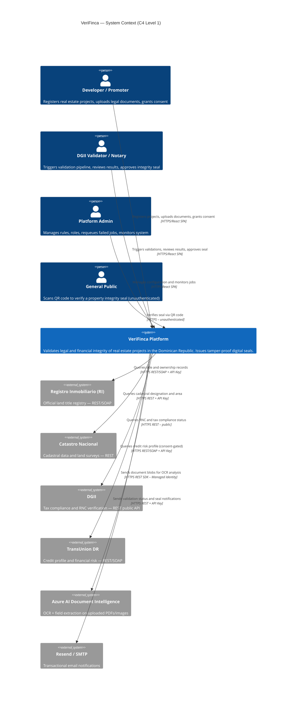
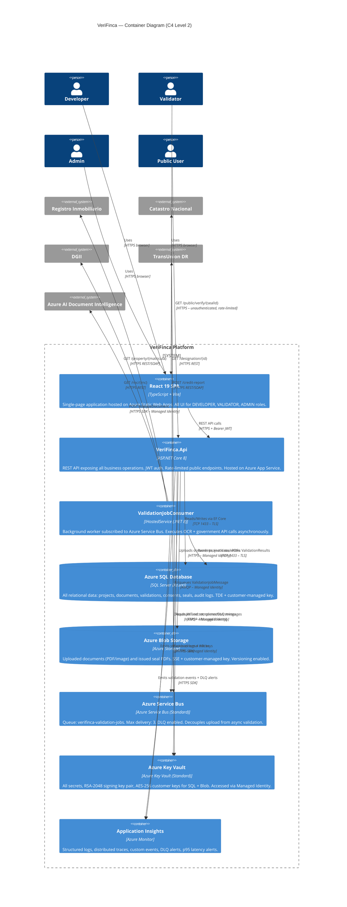
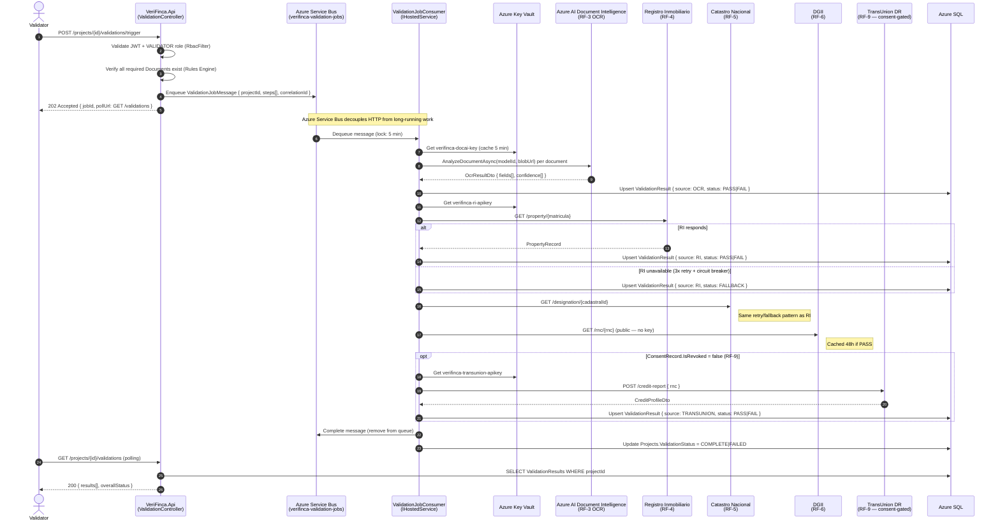
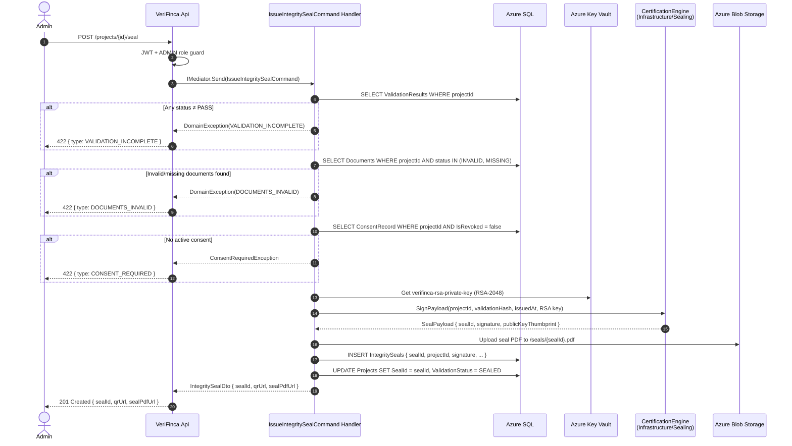
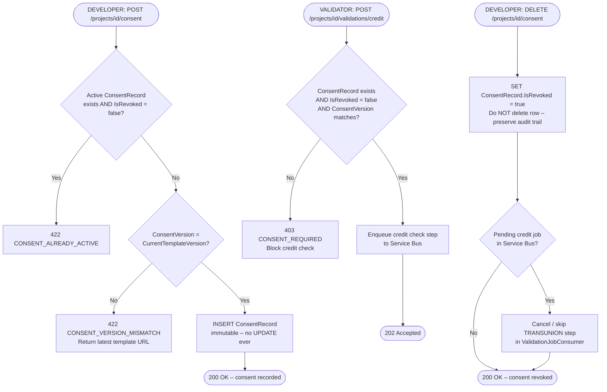
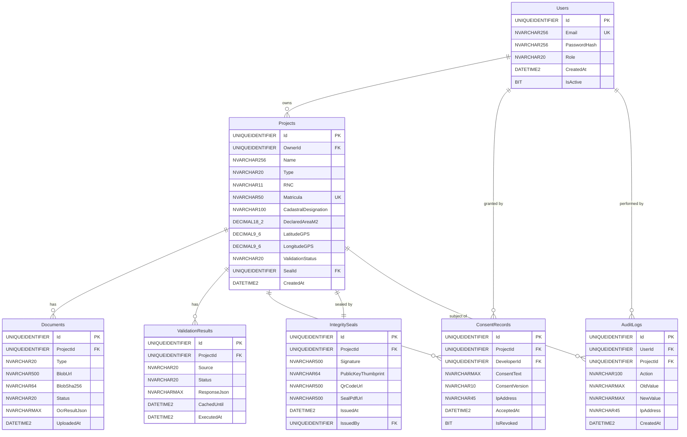
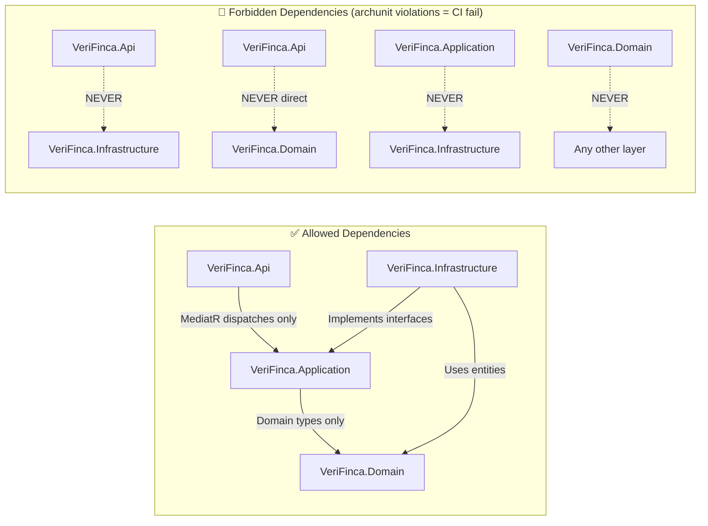
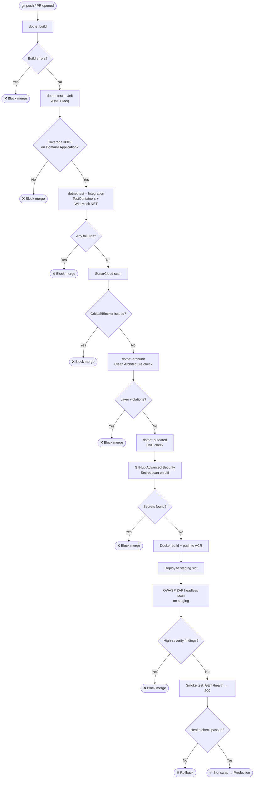
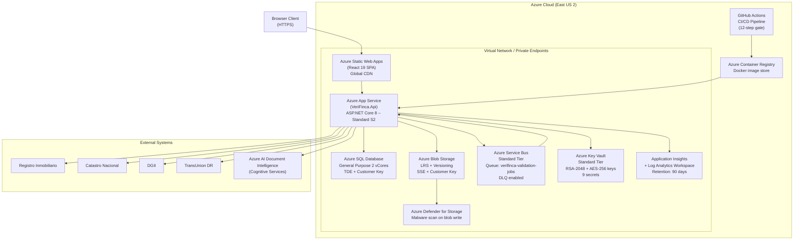

# ARCHITECTURE.md — VeriFinca

> **Version:** 1.0.0 | **Date:** 2026-05-25 | **Status:** Active
> **Maintainer Rule:** Every agent that alters data flow, service interaction, or schema **MUST** update the diagrams in this file before committing implementation code.
> **Related:** `TRD_VeriFinca.md` · `AGENTS.md` · `ADR/`

---

## Table of Contents

1. [C4 Level 1 — System Context](#1-c4-level-1--system-context)
2. [C4 Level 2 — Container Diagram](#2-c4-level-2--container-diagram)
3. [C4 Level 3 — Component Diagram (API + Application)](#3-c4-level-3--component-diagram-api--application)
4. [Async Validation Flow — Sequence Diagram](#4-async-validation-flow--sequence-diagram)
5. [Seal Issuance Flow — Sequence Diagram](#5-seal-issuance-flow--sequence-diagram)
6. [Consent & Credit Check Guard Flow](#6-consent--credit-check-guard-flow)
7. [Entity-Relationship Diagram (Core Schema)](#7-entity-relationship-diagram-core-schema)
8. [Clean Architecture Dependency Rules](#8-clean-architecture-dependency-rules)
9. [CI/CD Pipeline Flow](#9-cicd-pipeline-flow)
10. [Infrastructure Topology](#10-infrastructure-topology)

---

## 1. C4 Level 1 — System Context

> **Who** uses VeriFinca and **what external systems** does it interact with.



---

## 2. C4 Level 2 — Container Diagram

> **What deployable units** make up VeriFinca and how they communicate.



---

## 3. C4 Level 3 — Component Diagram (API + Application)

> **How responsibilities are split** inside the API and Application layers.

```mermaid
C4Component
  title VeriFinca.Api + VeriFinca.Application — Component Diagram (C4 Level 3)

  Container_Boundary(api, "VeriFinca.Api") {
    Component(authCtrl, "AuthController", "ASP.NET Controller", "POST /auth/login · POST /auth/refresh · POST /auth/logout")
    Component(projCtrl, "ProjectsController", "ASP.NET Controller", "POST /projects · GET /projects/{id} · GET /projects/{id}/documents/diagnosis")
    Component(valCtrl, "ValidationController", "ASP.NET Controller", "POST /validations/trigger · GET /validations · POST /consent · POST /validations/credit · POST /seal")
    Component(pubCtrl, "PublicController", "ASP.NET Controller", "GET /public/verify/{sealId} — unauthenticated, 60 req/min IP rate limit")
    Component(rbacFilter, "RbacAuthorizationFilter", "Action Filter", "Enforces ADMIN/DEVELOPER/VALIDATOR/PUBLIC role policy per endpoint")
    Component(errMiddleware, "ErrorHandlingMiddleware", "ASP.NET Middleware", "Catches all unhandled exceptions. Returns RFC 7807 problem details. No stack traces in production.")
    Component(secHeaders, "SecurityHeadersMiddleware", "ASP.NET Middleware", "Injects HSTS, X-Frame-Options, CSP, nosniff, Permissions-Policy on every response")
    Component(rateLimit, "RateLimitMiddleware", "ASP.NET Middleware", "Per-IP rate limiting on /public endpoints. Configurable via appsettings.")
  }

  Container_Boundary(app, "VeriFinca.Application") {
    Component(registerCmd, "RegisterProjectCommand + Handler", "MediatR Command", "Validates DTO (FluentValidation) → creates Project entity → persists via IProjectRepository")
    Component(uploadCmd, "UploadDocumentCommand + Handler", "MediatR Command", "Validates MIME + size → uploads to Blob → persists Document record → triggers Rules Engine diagnosis")
    Component(triggerCmd, "TriggerValidationCommand + Handler", "MediatR Command", "Validates all documents exist → enqueues ValidationJobMessage to Service Bus → returns jobId")
    Component(consentCmd, "RecordConsentCommand + Handler", "MediatR Command", "Validates consent version → inserts immutable ConsentRecord → blocks if already active")
    Component(sealCmd, "IssueIntegritySealCommand + Handler", "MediatR Command", "Guards: all PASS + consent active + no INVALID docs → calls ISealingService → persists IntegritySeal")
    Component(diagQuery, "GetDocumentDiagnosisQuery + Handler", "MediatR Query", "Runs Rules Engine across all project documents → returns missing/invalid document list with codes")
    Component(valQuery, "GetValidationResultsQuery + Handler", "MediatR Query", "Reads ValidationResults from DB → returns aggregated status per source")
    Component(validators, "FluentValidation Validators", "Validation Pipeline", "One validator class per DTO. All registered in DI pipeline via Assembly scan. Runs before every handler.")
  }

  Rel(authCtrl, app, "Dispatches commands via MediatR", "In-process")
  Rel(projCtrl, registerCmd, "IMediator.Send(RegisterProjectCommand)", "In-process")
  Rel(projCtrl, diagQuery, "IMediator.Send(GetDocumentDiagnosisQuery)", "In-process")
  Rel(valCtrl, triggerCmd, "IMediator.Send(TriggerValidationCommand)", "In-process")
  Rel(valCtrl, consentCmd, "IMediator.Send(RecordConsentCommand)", "In-process")
  Rel(valCtrl, sealCmd, "IMediator.Send(IssueIntegritySealCommand)", "In-process")
  Rel(valCtrl, valQuery, "IMediator.Send(GetValidationResultsQuery)", "In-process")
  Rel(rbacFilter, authCtrl, "Applied globally via filter pipeline", "ASP.NET filter chain")
  Rel(errMiddleware, authCtrl, "Wraps entire request pipeline", "ASP.NET middleware chain")
  Rel(validators, registerCmd, "Validates before handler executes", "MediatR pipeline behavior")
```

---

## 4. Async Validation Flow — Sequence Diagram

> **RF-3 → RF-7:** How a validation job travels from HTTP trigger to stored results.



---

## 5. Seal Issuance Flow — Sequence Diagram

> **RF-10:** How an integrity seal is issued after all validations pass.



---

## 6. Consent & Credit Check Guard Flow

> **RF-8 + RF-9 (Law 172-13):** How consent is recorded and how the credit check is gated.



---

## 7. Entity-Relationship Diagram (Core Schema)

> Matches `AppDbContext` exactly. **Sync check:** Zod schemas in the SPA must match this ERD.



---

## 8. Clean Architecture Dependency Rules

> Enforced at CI via `dotnet-archunit`. **Zero violations = merge gate.**



**Dependency Injection wiring:** All interface-to-implementation bindings live in `VeriFinca.Infrastructure/DependencyInjection.cs` and are registered in `Program.cs` via `builder.Services.AddInfrastructure(builder.Configuration)`. The `Api` layer never instantiates Infrastructure types directly.

---

## 9. CI/CD Pipeline Flow



---

## 10. Infrastructure Topology



---

## Diagram Update Protocol

Any agent (Architect, Coder, Reviewer) that performs one of the following actions **must update the relevant diagram in this file in the same commit** — no exceptions:

| Change Type | Diagrams to Update |
|---|---|
| New external API integration | C4 Level 1, C4 Level 2, §10 Infrastructure Topology |
| New Service Bus message type or queue | §4 Async Validation Flow |
| New domain entity or relationship | §7 ERD |
| New API endpoint | C4 Level 3 Component Diagram |
| New Application layer command/query | C4 Level 3 Component Diagram |
| New business rule guard | §5 or §6 Sequence/Flowchart |
| New Azure resource | §10 Infrastructure Topology |
| Change to CI/CD gates | §9 CI/CD Pipeline Flow |

---

*ADR cross-references: `ADR/ADR-001-service-bus-async-validation.md` · `ADR/ADR-002-azure-document-intelligence-ocr.md` · `ADR/ADR-003-key-vault-secret-management.md`*
