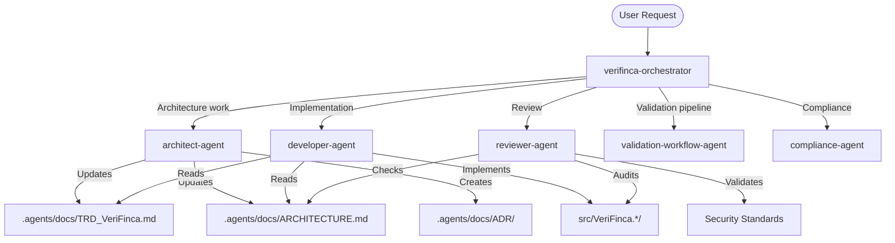
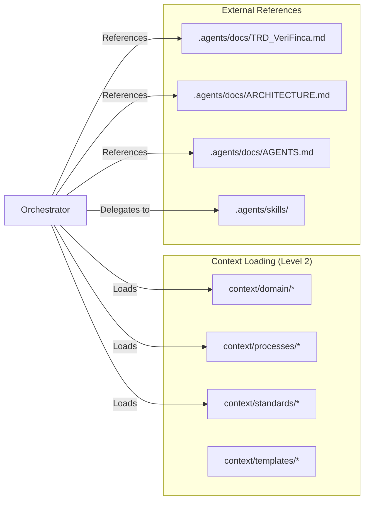

# .opencode System Architecture — VeriFinca

## Agent Topology

## Context Flow

## Three-Level Context Allocation

| Level | Frequency | Strategy |
|-------|-----------|----------|
| **Level 1** | 80% | Direct handling — no subagent, minimal context |
| **Level 2** | 15% | Route to subagent with filtered context files + TRD refs |
| **Level 3** | 5% | Multi-agent workflow with full context + coordination |

## Agent Routing Rules

1. **Simple questions, file reads, status checks** → Handle directly (Level 1)
2. **Single-scope technical work** → Route to relevant subagent (Level 2)
3. **Multi-step feature delivery** → Invoke `feature-delivery-workflow` (Level 3)
4. **Security audits** → Invoke `security-audit-workflow` (Level 3)
5. **Validation pipeline changes** → Invoke `validation-pipeline-workflow` (Level 3)

## File Naming Convention

- Agent files: `{role}-agent.md` (kebab-case)
- Subagent files: `{specialization}-agent.md`
- Context files: `{topic}.md` (kebab-case, grouped by category)
- Workflow files: `{process-name}-workflow.md`
- Command files: `{command-name}.md`

## Quality Gates

- All agent files must define: Role, Expertise, Input, Output, Process, Constraints, Context Dependencies
- All workflows must define: Purpose, Prerequisites, Steps with clear outputs, Verification checklist
- All commands must define: Purpose, Usage with options, Example, Output format, Related references
- Context files must be 30-100 lines (focused, not exhaustive)
