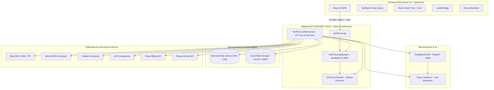

<br />

<p align="center">
  <picture>
    <source media="(prefers-color-scheme: dark)" srcset="src/frontend/web/public/brand/logotipo/LOGOTIPO%20WHITE.optimized.svg">
    
  </picture>
</p>

<h1 align="center">VeriFinca — Plataforma de Verificación y Autenticación de Proyectos Inmobiliarios</h1>

<p align="center">
  <em>Sistema web de verificación y autenticación integral de proyectos inmobiliarios para prevención de estafas financieras mediante la validación de documentación legal, financiera y de propiedad en la República Dominicana.</em>
</p>

> **Proyecto de Grado** — Universidad Central del Este (UCE), Escuela de Ingeniería de Software, Año 2026

> [!TIP]
> 📚 **Portal de Documentación Oficial y Arquitectura:**  
> Toda la documentación técnica, guías interactivas, especificaciones detalladas (TRD/PRD) y diagramas del sistema están organizados y publicados en:  
> 🌐 **[https://mintlify.wiki/AlvaGonz/Anteproyecto-Verify/architecture](https://mintlify.wiki/AlvaGonz/Anteproyecto-Verify/architecture)**

---

## 1. Resumen del Proyecto

**VeriFinca** es una plataforma integral diseñada para mitigar el fraude inmobiliario en la República Dominicana mediante la automatización de la validación cruzada entre la documentación aportada por desarrolladores y las bases de datos oficiales del Estado (Registro Inmobiliario, Dirección General de Impuestos Internos - DGII, Catastro Nacional, Ministerio de la Vivienda y Edificaciones - MIVED, Junta Central Electoral - JCE) y burós de crédito (TransUnion DR).

La plataforma emite **Sellos Digitales de Integridad** verificables públicamente mediante códigos QR tokenizados y certificados PDF firmados criptográficamente (RSA-2048) en estricto cumplimiento con la **Ley 126-02** (Comercio Electrónico y Firmas Digitales) y la **Ley 172-13** (Protección Integral de Datos Personales y Crediticios).

### Objetivos Específicos de Tesis (OE) y Requerimientos Funcionales (RF)

| OE | Objetivo Académico | Requerimientos Funcionales |
|:---|:---|:---|
| **OE-1** | Diagnosticar y clasificar la documentación esencial requerida según normativas de Registro Inmobiliario. | `RF-1`, `RF-2` |
| **OE-2** | Automatizar la validación de autenticidad documental contra fuentes oficiales (DGII, Catastro, MIVED, RI, JCE). | `RF-3`, `RF-4`, `RF-5`, `RF-6` |
| **OE-3** | Detectar duplicidades registrales, títulos solapados o reutilización no autorizada de matrículas/planos. | `RF-3`, `RF-4` |
| **OE-4** | Analizar inconsistencias en datos extraídos (OCR/IA) y generar alertas de riesgo parametrizables. | `RF-2`, `RF-3`, `RF-7` |
| **OE-5** | Validar la correspondencia territorial y espacial mediante georreferenciación y designación catastral. | `RF-5`, `RF-7` |
| **OE-6** | Verificar solvencia financiera y estatus crediticio del promotor/desarrollador con consentimiento previo auditable (Ley 172-13). | `RF-8`, `RF-9` |
| **OE-7** | Certificar la integridad mediante Sellos Digitales, hash SHA-256, certificados PDF y validación pública vía QR (Ley 126-02). | `RF-10`, `RF-11` |

---

## 2. Arquitectura del Sistema

El sistema implementa una **Arquitectura Limpia (Clean Architecture)** desacoplada en el backend, complementada por un **Microservicio de Visión Artificial (OCR)** en Python FastAPI y un **Frontend SPA reactivo** en React 19.

### Capas del Backend (`src/backend/`)

1. **`VeriFinca.Domain`**: Entidades centrales, enums de dominio, interfaces de repositorio, especificaciones y excepciones puras. Sin dependencias externas.
2. **`VeriFinca.Application`**: Casos de uso implementados mediante **MediatR** (Commands y Queries), validaciones con **FluentValidation**, DTOs, mapeadores y contratos de servicios.
3. **`VeriFinca.Infrastructure`**: Persistencia con **Entity Framework Core 8** (SQL Server), integraciones con Azure Blob Storage (Azurite), microservicio PaddleOCR, pasarela Stripe, servicio de correo Resend, QuestPDF y adaptadores externos.
4. **`VeriFinca.Api`**: Controladores REST, middlewares de seguridad, filtros de autorización RBAC, health checks, Swagger OpenAPI y configuración de inyección de dependencias.



---

## 3. Stack Tecnológico

### Backend (.NET 8)
- **Framework:** ASP.NET Core 8.0 (`net8.0`)
- **ORM / Base de Datos:** Entity Framework Core 8.0.2 sobre Microsoft SQL Server 2022
- **Patrón CQRS & Mensajería Interna:** MediatR 12.4.1
- **Validación de Modelos:** FluentValidation 12.1.1
- **Generación de Reportes y Certificados PDF:** QuestPDF 2024.3.4 (con soporte de diseño vectorial y sellado visual)
- **Exportación de Datos:** ClosedXML 0.102.2 (Excel)
- **Facturación y Suscripciones:** Stripe.net 52.1.1 (Planes: Profesional, Empresa, Corporativo)
- **Notificaciones por Correo:** Resend .NET SDK 0.5.1
- **Procesamiento de Imágenes:** SixLabors.ImageSharp 3.1.11
- **Almacenamiento de Blobs:** Azure.Storage.Blobs 12.23.0 (y emulador Azurite)
- **Seguridad & Hashing:** BCrypt.Net-Next 4.0.3, JWT Bearer 8.0.2, Google OAuth Token Verification

### Microservicio OCR & Visión Artificial (`src/microservices/paddleocr-api`)
- **Framework API:** FastAPI 0.111.0 + Uvicorn 0.30.1
- **Motor de Inferencia OCR:** PaddleOCR 2.8.1 + PaddlePaddle 2.6.2
- **Rasterizado de Documentos:** PyMuPDF (fitz) 1.24.4 a 300 DPI híbrido
- **Pre-procesamiento Digital:** OpenCV Headless 4.9.0 (Otsu Thresholding, Non-Local Means Denoising, Anti-UTM Filters)
- **Razonamiento Documental:** Integración con Groq Cloud (`meta-llama/llama-4-scout-17b-16e-instruct`, `llama-3.1-8b-instant`)

### Frontend Web (`src/frontend/web`)
- **Core:** React 19.2.6, TypeScript ~5.8 / ~5.6, Vite 6.4.3
- **Enrutamiento:** React Router DOM 7.16.0
- **Estilos y Diseño:** Tailwind CSS 4.3.0 (`@tailwindcss/vite`), Lucide React 0.546.0, Framer Motion 12.40.0
- **Gestión de Estado Servidor:** TanStack React Query 5.101.0
- **Formularios & Validación:** React Hook Form 7.77.0 + `@hookform/resolvers` + Zod 4.0.0
- **Mapas & Georreferenciación:** Leaflet 1.9.4 + `@types/leaflet`
- **Pagos:** `@stripe/react-stripe-js` 6.6.0 + `@stripe/stripe-js` 9.8.0
- **Autenticación Social:** `@react-oauth/google` 0.13.5
- **Generación de QR & Reportes:** `react-qr-code` 2.0.21, `react-to-print` 3.3.0, `exceljs` 4.4.0

### Pruebas & Calidad
- **Backend Unit Tests:** xUnit 2.6.6, Moq 4.20.70, FluentAssertions 6.12.0
- **Architecture Tests:** NetArchTest.Rules 1.3.2 (Clean Architecture boundary enforcement)
- **Backend Integration Tests:** Testcontainers MsSql 4.12.0, Microsoft.AspNetCore.Mvc.Testing 8.0.0
- **Frontend Unit/Component Tests:** Vitest 4.1.8, Testing Library React 16.3.2, @vitest/coverage-v8
- **E2E & Performance Testing:** Playwright 1.61.0 + Performance Budget Guard

---

## 4. Estructura del Repositorio

```
Anteproyecto-Verify/
├── .agents/                        # Configuración de agentes, reglas, workflows y documentación
│   ├── docs/                       # Especificaciones, arquitectura (C4/ERD) y progress log
│   │   ├── ARCHITECTURE.md         # Diagramas C4, flujos de validación y ERD
│   │   ├── TRD_VeriFinca.md        # Documento de Requerimientos Técnicos
│   │   └── PWF/progress.md         # Registro formal de sesiones y tareas completadas
│   ├── rules/                      # Reglas de desarrollo (seguridad, TypeScript, dominio inmobiliario)
│   ├── skills/                     # Habilidades y agentes especializados (ECC v2.2.0)
│   └── workflows/                  # Flujos guiados de automatización
├── Bots/                           # Bots de scraping y generadores de datos gubernamentales
│   ├── DGII/                       # Ingestión masiva de RNC y contribuyentes DGII
│   ├── Mived Licencias/            # Validación de licencias de construcción MIVED
│   ├── CatastroTitulo/             # Títulos catastrales y parcelas
│   ├── JCE_Ciudadano/              # Verificación de identidad y padrón JCE
│   └── PagoIPI/                    # Registros de pago de impuesto inmobiliario
├── docker/                         # Dockerfiles para API, Frontend, SQL Server y Azurite
├── e2e/                            # Pruebas End-to-End con Playwright
│   ├── auth/                       # Flujos de login, registro, Google OAuth y 2FA
│   ├── projects/                   # Ciclo de vida del proyecto, fotos y validaciones
│   ├── ocr/                        # Verificación visual de extracción de títulos, IPI y cédulas
│   └── performance/                # Auditorías de presupuesto de rendimiento
├── scripts/                        # Utilidades de mantenimiento, guards y gestión de paquetes
├── src/
│   ├── backend/                    # Solución .NET 8 (Clean Architecture)
│   │   ├── Api/                    # REST API Controllers, Middlewares, Program.cs
│   │   ├── Application/            # CQRS Handlers, DTOs, Validators, Interfaces
│   │   ├── Domain/                 # Entidades (44), Enums (25), Value Objects
│   │   ├── Infrastructure/         # EF Core DbContext, Migrations, External Adapters
│   │   ├── Api.Tests/              # Pruebas de integración de la API
│   │   └── Tools/DbSeeder/         # Seeder autónomo y scripts de carga de datos
│   ├── frontend/
│   │   └── web/                    # Aplicación SPA React 19
│   │       ├── src/
│   │       │   ├── components/     # Componentes compartidos de UI
│   │       │   ├── features/       # Módulos de proyectos, documentos, auth, pagos
│   │       │   ├── pages/          # Páginas públicas y panel administrativo
│   │       │   ├── services/       # Clientes Axios y llamadas a endpoints
│   │       │   └── router/         # Configuración de React Router DOM
│   │       └── package.json        # Dependencias frontend
│   └── microservices/
│       └── paddleocr-api/          # Microservicio FastAPI PaddleOCR para ingestión de PDFs
├── tests/                          # Suites globales de pruebas
│   ├── backend/
│   │   ├── UnitTests/              # Pruebas unitarias de dominio y aplicación
│   │   └── IntegrationTests/       # Pruebas de integración con Testcontainers
│   └── frontend/                   # Pruebas unitarias y de componentes frontend
├── AGENTS.md                       # Constitución y protocolos obligatorios para IA (v5.0.0)
├── docker-compose.yml              # Orquestación de contenedores (Stack completo)
├── docker-compose.dev.yml          # Override de desarrollo con hot-reload
├── package.json                    # Scripts del workspace raíz
└── README.md                       # Documentación principal del proyecto
```

---

## 5. Modelo de Datos y Entidades Principales

El esquema de base de datos relacional contiene **44 entidades** y **25 enumeradores** estructurados en dominios clave:

### Entidades del Dominio (`src/backend/Domain/Entities/`)

| Categoría | Entidades Principales | Propósito |
|:---|:---|:---|
| **Proyectos & Documentos** | `Proyecto`, `Documento`, `CategoriaProyecto`, `ProyectoEstado`, `ProyectoGuardado`, `ProyectoInteresado`, `DatoValidado` | Gestión del ciclo de vida inmobiliario, categorización y trazabilidad de archivos cargados con hash SHA-256. |
| **Validaciones & Integridad** | `Validacion`, `ReglaValidacion`, `ResultadoRegla`, `AlertaValidacion`, `Hallazgo`, `DeteccionDuplicidad`, `SelloIntegridad`, `Certificacion`, `ProyectoValidacionDescargo` | Ejecución del motor de reglas, detección de duplicidades registrales y emisión de sellos criptográficos. |
| **Gobernanza Estatal (Mocks/Scrapers)** | `CatastroTitulo`, `DGII`, `LicenciaConstruccion`, `PermisoSuelo`, `PagoIPI`, `JCE_Ciudadano`, `ValidacionDgii`, `ValidacionAyuntamiento` | Tablas de consulta cruzada para títulos catastrales, permisos de uso de suelo, licencias MIVED y solvencia fiscal. |
| **Usuarios, Seguridad & RBAC** | `Usuario`, `Perfil`, `Permiso`, `PerfilPermiso`, `SesionUsuario`, `Verificacion2FA`, `Invitacion` | Control de acceso basado en roles (`Admin`, `Validator`, `Developer`, `Public`), autenticación de dos factores e invitaciones de equipo. |
| **Financiero & Cumplimiento** | `ConsentimientoFinanciero`, `ResultadoCrediticio`, `PlanSuscripcion`, `Pago` | Registro inmutable de consentimiento conforme a Ley 172-13, consultas a TransUnion y suscripciones de Stripe. |
| **Auditoría & Comunicaciones** | `Auditoria`, `LogConsulta`, `LogProyecto`, `Reporte`, `Notificacion`, `NotificacionEntrega`, `TipoNotificacion` | Registro cronológico inmutable (retención 7 años) de todas las operaciones, descargas y notificaciones del sistema. |
| **Geografía Dominicana** | `Provincia`, `Municipio` | División político-territorial oficial para normalización catastral. |

---

## 6. Puesta en Marcha Rápida (Quick Start)

### Requisitos Previos
- [Docker Desktop](https://www.docker.com/products/docker-desktop/) (con WSL2 en Windows)
- [Node.js](https://nodejs.org/) (v20+) y [pnpm](https://pnpm.io/) (v9+)
- [.NET 8 SDK](https://dotnet.microsoft.com/download/dotnet/8.0) (opcional si se ejecuta con Docker)
- [Python 3.12](https://www.python.org/) (opcional para desarrollo local de scripts de bots)

---

### Opción A: Despliegue con Docker (Recomendado)

Inicia todos los servicios del stack (API, Frontend, SQL Server, Azurite, PaddleOCR y Bots):

```bash
# 1. Clonar el repositorio y acceder
git clone https://github.com/AlvaGonz/Anteproyecto-Verify.git
cd Anteproyecto-Verify

# 2. Configurar variables de entorno (crear .env a partir de .env.development si es necesario)
cp .env.development .env

# 3. Levantar los contenedores
docker compose up -d --build
```

#### Servicios Disponibles

| Servicio | URL Local | Descripción |
|:---|:---|:---|
| **Frontend Web** | `http://localhost:3000` | Interfaz SPA en React 19 |
| **Backend API** | `http://localhost:5000` | REST API en ASP.NET Core 8 |
| **Documentación Swagger** | `http://localhost:5000/swagger` | Explorador interactivo de endpoints |
| **Health Check** | `http://localhost:5000/health` | Estado de salud de API y SQL Server |
| **Microservicio PaddleOCR** | `http://localhost:8000/docs` | FastAPI Swagger para pruebas de OCR |
| **Microsoft SQL Server** | `localhost:1433` | Base de datos `verifinca-spm-uce-2026` |
| **Azurite (Azure Blob)** | `localhost:10000` | Emulador de almacenamiento de documentos |

---

### Opción B: Ejecución Local de Desarrollo (Frontend & Backend)

#### 1. Frontend Web
```bash
cd src/frontend/web
pnpm install
pnpm run dev
# Disponible en http://localhost:3000
```

#### 2. Backend API
```bash
cd src/backend/Api
dotnet restore
dotnet run
# Disponible en http://localhost:5000
```

#### 3. Microservicio PaddleOCR
```bash
cd src/microservices/paddleocr-api
python -m venv .venv
source .venv/bin/activate  # En Windows: .venv\Scripts\activate
pip install -r requirements.txt
uvicorn main:app --host 0.0.0.0 --port 8000 --reload
```

---

### Gestión de Migraciones de Base de Datos (EF Core)

```bash
cd src/backend

# Crear una nueva migración
dotnet ef migrations add <NombreMigracion> \
  --project Infrastructure/Infrastructure.csproj \
  --startup-project Api/Api.csproj \
  --output-dir Persistence/Migrations

# Aplicar migraciones a la base de datos activa
dotnet ef database update \
  --project Infrastructure/Infrastructure.csproj \
  --startup-project Api/Api.csproj
```

---

## 7. Referencia de Comandos y Scripts

### Scripts en el `package.json` Raíz

| Comando | Descripción |
|:---|:---|
| `pnpm run dev` | Inicia el servidor de desarrollo de Vite en el puerto 3000 con soporte host. |
| `pnpm run build` | Compila el frontend para producción y ejecuta el guard de presupuesto de rendimiento. |
| `pnpm run preview` | Previsualiza el bundle compilado de producción localmente. |
| `pnpm run lint` | Ejecuta la verificación estricta de tipos con TypeScript (`tsc --noEmit`). |
| `pnpm run clean` | Limpia los directorios de compilación `dist/`. |
| `pnpm run db:seed` | Ejecuta el seeder de base de datos `DbSeeder.csproj` dentro del contenedor Docker. |
| `pnpm run test:e2e` | Ejecuta la suite de pruebas End-to-End con Playwright. |
| `pnpm run test:perf` | Ejecuta las pruebas de rendimiento web con Playwright. |
| `pnpm run test:perf:prod` | Compila en modo producción y valida el presupuesto de rendimiento con reporte detallado. |
| `pnpm run perf:budget` | Valida el tamaño de los chunks y recursos estáticos contra los límites establecidos. |
| `pnpm run doctor` | Ejecuta el diagnóstico de salud de la aplicación React (`react-doctor`). |

### Scripts en `src/frontend/web/package.json`

| Comando | Descripción |
|:---|:---|
| `pnpm run test` | Ejecuta las pruebas unitarias y de componentes con **Vitest**. |
| `pnpm run typecheck` | Comprueba tipos de TypeScript mediante `tsc -b`. |
| `pnpm run typecheck:tests` | Valida tipos en archivos de pruebas con `tsconfig.test.json`. |
| `pnpm run lint` | Ejecuta ESLint en todo el código fuente del frontend. |

---

## 8. Configuración de Variables de Entorno

| Variable | Requerido | Descripción | Ejemplo / Valor por Defecto |
|:---|:---:|:---|:---|
| `ASPNETCORE_ENVIRONMENT` | Sí | Entorno de ejecución de ASP.NET Core | `Development` / `Production` |
| `ConnectionStrings__DefaultConnection` | Sí | Cadena de conexión SQL Server | `Server=localhost,1433;Initial Catalog=verifinca-spm-uce-2026;User ID=sa;Password=Your_password123;TrustServerCertificate=True;` |
| `AzureBlob__ConnectionString` | Sí | Cadena de conexión de Azure Blob Storage o Azurite | `UseDevelopmentStorage=true;` |
| `AzureBlob__ContainerName` | Sí | Nombre del contenedor para almacenar documentos y sellos | `uploads` |
| `Jwt__Secret` | Sí | Clave secreta simétrica para firma de tokens JWT (min 32 bytes) | `<secret-key-32-chars-min>` |
| `Jwt__Issuer` | Sí | Emisor del token JWT | `AppIssuer` |
| `Jwt__Audience` | Sí | Audiencia válida del token JWT | `AppAudience` |
| `ALLOWED_ORIGINS` | Sí | Orígenes CORS autorizados separados por coma | `http://localhost:3000,http://localhost:5173` |
| `VITE_API_URL` | Sí | URL base de la API consumida por el frontend | `http://localhost:5000` |
| `VITE_USE_MOCK` | No | Bandera para pruebas locales con mock adapters | `false` |
| `GROQ_API_KEY` | Sí | API Key de Groq Cloud para inferencia LLM en documentos | `gsk_...` |
| `GROQ_MODEL_PRIMARY` | No | Modelo principal de extracción documental | `meta-llama/llama-4-scout-17b-16e-instruct` |
| `GROQ_MODEL_FAST` | No | Modelo rápido para clasificaciones ligeras | `llama-3.1-8b-instant` |
| `RESEND__APITOKEN` | Sí | Token de API de Resend para correos transaccionales | `re_...` |
| `RESEND__FromEmail` | Sí | Dirección de remitente verificada en Resend | `noreply@verifinca.lat` |
| `Stripe__SecretKey` | Sí | Clave secreta de Stripe para cobros y suscripciones | `sk_test_...` |
| `VITE_STRIPE_PUBLISHABLE_KEY` | Sí | Clave pública de Stripe para el frontend | `pk_test_...` |
| `VITE_GOOGLE_CLIENT_ID` | Sí | Client ID de Google OAuth para inicio de sesión social | `7970...apps.googleusercontent.com` |

---

## 9. Pruebas y Control de Calidad

```bash
# Ejecutar todas las pruebas unitarias del backend
dotnet test tests/backend/UnitTests/UnitTests.csproj

# Ejecutar pruebas de arquitectura y límites Clean Architecture
dotnet test tests/backend/UnitTests/UnitTests.csproj --filter Category=Architecture

# Ejecutar pruebas de integración con Testcontainers (requiere Docker activo)
dotnet test tests/backend/IntegrationTests/IntegrationTests.csproj

# Ejecutar pruebas unitarias de frontend con Vitest
cd src/frontend/web && pnpm run test

# Ejecutar suite de pruebas E2E con Playwright
npx playwright test e2e/

# Ejecutar pruebas específicas de extracción visual OCR
npx playwright test e2e/ocr/
```

### Cobertura Mínima Exigida por Capa

| Capa | Cobertura Mínima | Mecanismo de Control |
|:---|:---:|:---|
| **Domain** | **90%** | xUnit + FluentAssertions |
| **Application** | **80%** | xUnit + Moq |
| **Infrastructure.Sealing (Sellos)** | **100%** | xUnit (Firma criptográfica y QR) |
| **Infrastructure.ExternalApis** | **70%** | Testcontainers + WireMock |
| **Frontend Features & Mappers** | **80%** | Vitest + React Testing Library |

---

## 10. Seguridad y Cumplimiento Normativo

1. **Ley 126-02 (Firmas Digitales y Sellos de Integridad):** Los sellos digitales de integridad solo se generan cuando el 100% de las validaciones del proyecto tienen estado `PASS` y no existen alertas críticas pendientes. Cada sello incluye firma digital RSA-2048, thumbprint público y código QR tokenizado para consulta pública.
2. **Ley 172-13 (Protección de Datos Crediticios):** La consulta de antecedentes y calificación financiera ante TransUnion está blindada por un registro inmutable de consentimiento (`ConsentimientoFinanciero`). Si el consentimiento está revocado o no coincide con la versión vigente, la consulta es rechazada a nivel de dominio.
3. **Auditoría e Inmutabilidad:** Los registros de `Auditoria` y `ConsentimientoFinanciero` poseen una política estricta de retención de 7 años sin operaciones `UPDATE` ni `DELETE`.
4. **Prevención OWASP Top 10:** Consultas SQL 100% parametrizadas a través de EF Core, validación de esquemas en cliente y servidor con Zod y FluentValidation, hashes de contraseñas con BCrypt (12 rondas), cabeceras de seguridad estrictas (HSTS, CSP, X-Frame-Options, no-sniff) y mitigación de inyección de código.

---

## 11. Protocolo de Agentes IA (`codebase-memory-mcp`)

Todos los asistentes y agentes que operan en este repositorio deben cumplir rigurosamente las directivas de [AGENTS.md](./AGENTS.md):

1. **Bootstrap Obligatorio:** Ejecutar `get_architecture` y `get_graph_schema` como primera acción de cada sesión.
2. **Verificación de Grafo:** Ejecutar `search_graph` antes de leer o editar cualquier archivo.
3. **Radio de Impacto:** Ejecutar `trace_path` (profundidad ≥ 3) antes de refactorizar servicios o interfaces compartidas.
4. **Actualización de Memoria:** Registrar el progreso en `@.agents/docs/PWF/progress.md` al finalizar cada sesión de trabajo.

---

## 12. Documentación Oficial y Wiki Interactiva

Toda la documentación técnica, arquitectónica y operativa del proyecto ha sido consolidada en un portal web interactivo powered by Mintlify:

- 🌐 **Portal Wiki:** [https://mintlify.wiki/AlvaGonz/Anteproyecto-Verify/architecture](https://mintlify.wiki/AlvaGonz/Anteproyecto-Verify/architecture)
- **Contenidos incluidos:**
  - Diagramas C4 (Context, Containers, Components) y flujos de secuencia interactivos.
  - Documentos de requerimientos técnicos y de producto (`TRD_VeriFinca.md` y `PRD_VeriFinca.md`).
  - Matriz de validación documental y reglas de negocio para República Dominicana.
  - Registros de decisiones arquitectónicas (`ADRs`).

---

## 13. Licencia y Créditos

Este proyecto es un trabajo de grado desarrollado para la **Universidad Central del Este (UCE)**, Escuela de Ingeniería de Software, República Dominicana, 2026.
Todos los derechos reservados.


