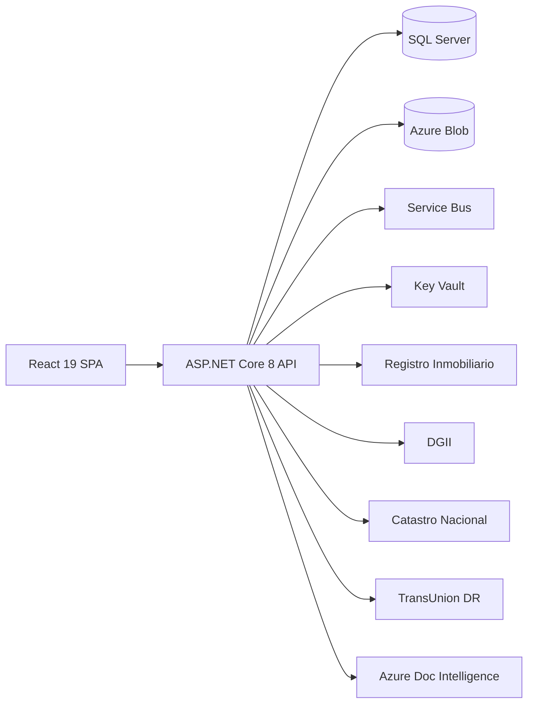

# VeriFinca — Real Estate Verification & Authentication Platform

> **Proyecto de Grado** — Universidad Central del Este, Escuela de Ingeniería de Software, 2026
>
> Sistema web de verificación y autenticación integral de proyectos inmobiliarios para
> prevención de estafas financieras mediante la validación de documentación legal,
> financiera y de propiedad en la República Dominicana.

---

## 1. Project Overview

VeriFinca automates the validation of real estate project documentation against Dominican
Republic government databases (Registro Inmobiliario, DGII, Catastro Nacional) and financial
credit bureaus (TransUnion DR) to prevent fraud. It issues tamper-proof Digital Integrity
Seals (Law 126-02) backed by RSA-2048 signatures and publicly verifiable via QR codes.

### Thesis Objectives

| OE | Objective | Core RF |
|---|---|---|
| OE-1 | Diagnose essential documents based on RI regulations | RF-2 |
| OE-2 | Automate validation via DGII, Catastro, RI APIs | RF-3 → RF-6 |
| OE-3 | Detect registry/documentary duplicities | RF-3, RF-4 |
| OE-4 | Detect document inconsistencies and risk alerts | RF-2, RF-3 |
| OE-5 | Validate territorial correspondence via georeferencing | RF-5, RF-7 |
| OE-6 | Verify developer financial/credit status (Law 172-13) | RF-8, RF-9 |
| OE-7 | Certify integrity via Digital Seal + QR + digital signature (Law 126-02) | RF-10, RF-11 |

---

## 2. Architecture at a Glance

**Pattern:** Clean Architecture (Domain → Application → Infrastructure → Api)

| Layer | Projects | Responsibility |
|-------|----------|----------------|
| `VeriFinca.Domain` | 1 | Entities, Enums, Interfaces, Exceptions — zero dependencies |
| `VeriFinca.Application` | 1 | Commands, Queries, Handlers (MediatR), DTOs, FluentValidation |
| `VeriFinca.Infrastructure` | 1 | EF Core, External APIs (RI/DGII/Catastro/TransUnion), Azure Blob, Service Bus, Key Vault |
| `VeriFinca.Api` | 1 | Controllers, Middleware, RBAC Filters, `Program.cs` |
| Frontend SPA | 1 | React 19 + TanStack Query + Zod + Tailwind 4 |
| Tests | 3 | Unit (xUnit+Moq), Integration (TestContainers+WireMock), Api.Tests |

**Boundary enforcement:** `dotnet-archunit` in CI — layer violations block merge.



---

## 3. Tech Stack

### Backend

| Package | Version |
|---------|---------|
| .NET | 8.0 (net8.0) |
| ASP.NET Core | 8.0 |
| Entity Framework Core (SQL Server) | 8.0.2 |
| MediatR | Latest |
| FluentValidation | Latest |
| BCrypt.Net-Next | Latest |
| QuestPDF | Latest |
| ClosedXML | Latest |
| Polly | Latest |

### Frontend

| Package | Version |
|---------|---------|
| React | ^19.2.6 |
| React Router DOM | ^7.16.0 |
| TypeScript | ~5.6.3 |
| Vite | ^6.4.3 |
| TanStack React Query | ^5.101.0 |
| Tailwind CSS | ^4.3.0 |
| Zod | ^3.25.76 |
| Framer Motion | ^12.40.0 |
| Axios | ^1.16.1 |
| Lucide React | ^0.546.0 |
| i18next | ^23.16.8 |

### Testing

| Package | Version |
|---------|---------|
| Vitest | ^4.1.8 |
| Playwright | ^1.60.0 |
| Testing Library (React) | ^16.3.2 |
| xUnit + Moq | Latest |
| WireMock.NET | Latest |

---

## 4. Project Structure

```
Anteproyecto-Verify/
├── .agents/                        # Agent rules, docs, sessions
│   ├── docs/
│   │   ├── ARCHITECTURE.md         # Mermaid C4/ERD/Sequence diagrams
│   │   ├── TRD_VeriFinca.md        # Technical Requirements Document
│   │   └── PWF/progress.md         # Agent progress tracker
│   ├── rules/                      # Conditional agent rules
│   └── skills/                     # Agent skill definitions
├── src/
│   ├── backend/
│   │   ├── Api/                    # Controllers, Middleware, Filters, Program.cs
│   │   ├── Application/            # Commands, Queries, Handlers, DTOs, Validators
│   │   ├── Domain/                 # Entities, Enums, Interfaces, Exceptions
│   │   ├── Infrastructure/         # EF Core, External APIs, Messaging, Sealing
│   │   ├── Api.Tests/              # API-level tests
│   │   ├── Tests/Integration/      # TestContainers + WireMock integration tests
│   │   └── Tools/DbSeeder/         # Database seeding utility
│   └── frontend/web/
│       └── src/
│           ├── features/           # Feature modules (projects, documents, auth)
│           ├── pages/              # Route pages (admin, public)
│           ├── infrastructure/     # API client, schemas, i18n
│           └── router/             # React Router config (hash routing)
├── e2e/                            # Playwright E2E tests
│   ├── auth/                       # Authentication flows
│   ├── projects/                   # Project CRUD + photos
│   └── api/                        # API contract tests
├── AGENTS.md                       # Agent constitution (v5.0.0 — codebase-memory-mcp §0)
├── docker-compose.yml              # Full stack: API + SQL + Azurite
├── playwright.config.ts            # E2E test configuration
└── pnpm-workspace.yaml             # pnpm workspace definition
```

---

## 5. Quick Start

### Docker (Full Stack — Recommended)

```bash
# Verify .env exists with required variables
docker compose up -d
```

| Service | URL |
|---------|-----|
| Frontend | http://localhost:3000 |
| Backend API | http://localhost:5000 |
| Health check | http://localhost:5000/health |
| Status | http://localhost:5000/api/status |
| SQL Server | localhost:1433 |
| Azurite (Blob) | localhost:10000 |

### Frontend-Only (No Docker)

```bash
cd src/frontend/web
pnpm install
pnpm run dev          # starts on port 3000
```

### Database Migration

```bash
cd src/backend
dotnet ef migrations add <Name> \
  --project Infrastructure/Infrastructure.csproj \
  --startup-project Api/Api.csproj \
  --output-dir Persistence/Migrations
```

---

## 6. Agent Rules

All AI agents operating in this repository must comply with [AGENTS.md](./AGENTS.md) (v5.0.0).

### Key Mandatory Rules

| Rule | Enforcement |
|------|-------------|
| **CM-1** | `get_architecture` must be the FIRST call of every session |
| **CM-2** | `detect_changes` before every `git push` or PR |
| **CM-3** | `search_graph` before creating any new file |
| **CM-4** | `trace_path` (depth ≥ 3) before refactoring shared services |
| **CM-5** | `index_status` → `index_repository` if stale |
| **CM-6** | Re-run `get_architecture` mid-task if touching >3 files |

---

## 7. Skills & MCPs Active in This Repo

| MCP Server | Status | Purpose |
|---|---|---|
| **codebase-memory-mcp** | 🔴 Mandatory (§0 AGENTS.md) | Full semantic graph: symbols, imports, call chains, blast radius |
| **GitHub MCP** | Active | PR/issue context, branch management |
| **context7-mcp** | Active | Live framework docs (ASP.NET Core 8, React 19, Zod, TanStack Query) |
| **Azure SQL / DB MCP (mssql)** | Active | Schema reads, migration verification |
| **Stitch MCP** | Active | VeriFinca design tokens (`#F98513`, `#223382`, `#9BACD8`, `#DAD1C8`) |
| **Azure Key Vault MCP** | Planned | Secret audit and inventory validation |

---

## 8. Testing Quick Reference

```bash
# Backend unit tests (80%+ coverage gate)
dotnet test tests/backend/UnitTests/UnitTests.csproj

# Backend integration tests (requires Docker SQL Server)
dotnet test tests/backend/IntegrationTests/IntegrationTests.csproj

# Backend API tests
dotnet test src/backend/Api.Tests/Api.Tests.csproj

# Frontend unit tests (Vitest)
cd src/frontend/web && pnpm run test

# E2E tests (Playwright)
npx playwright test e2e/projects/
npx playwright test e2e/auth/
```

| Layer | Min Coverage |
|---|---|
| Domain | 90% |
| Application | 80% |
| Infrastructure.Sealing | 100% |
| Infrastructure.ExternalApis | 70% |

---

## 9. Security & Compliance

| # | Invariant | Reference |
|---|---|---|
| 1 | Never write raw SQL — EF Core parameterized queries only | OWASP A03 |
| 2 | All secrets in Azure Key Vault — never in code or config files | OWASP A02 |
| 3 | FluentValidation on every DTO — no exceptions | OWASP A03 |
| 4 | IntegritySeal only when ALL validations PASS | OE-7, RF-10 |
| 5 | ConsentRecords/AuditLogs: 7-year retention, no deletes | Law 172-13 |
| 6 | TransUnion query only with active, version-matched consent | Law 172-13, OE-6 |
| 7 | RSA-2048 signing via Azure Key Vault for Digital Seals | Law 126-02 |
| 8 | No stack traces in production error responses | OWASP A05 |
| 9 | SHA-256 hash on all uploaded documents | OWASP A08, OE-3 |
| 10 | Security headers on every response (HSTS, CSP, X-Frame-Options) | OWASP A05 |

---

## 10. Contributing

### Branch Strategy

- `main` — production, protected, slot-swap only
- `develop` — integration branch, all PRs target here
- `feat/<name>` — feature branches
- `fix/<name>` — bugfix branches

### Commit Format (Conventional Commits)

```
feat(rf-3): implement OCR field extraction
fix(rf-9): block TransUnion query when consent revoked
test(oe-3): add duplicate matricula detection test
docs(agents): v5 — codebase-memory-mcp enforced as §0
```

### Human Gates (Require Explicit Approval)

- EF Core migrations (irreversible in production)
- Changes to `ConsentRecords` / `AuditLogs` schema (Law 172-13)
- Changes to `IntegritySeals` / `CertificationEngine` (Law 126-02)
- New external API integrations
- RBAC / JWT configuration changes
- Production deployment

### PR Requirements

- All 12 CI gates must pass (see AGENTS.md §14)
- `detect_changes` blast radius documented in PR description
- Zod ↔ FluentValidation sync verified
- ARCHITECTURE.md updated if data flow changed

---

## License

This project is a thesis work for Universidad Central del Este (UCE), 2026.
All rights reserved.
